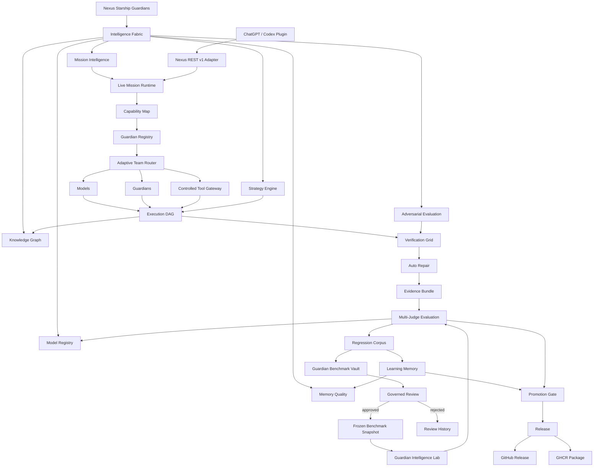

# Nexus Starship Guardians · v0.6.0


**A reusable Guardian engineering runtime for Lucio AI Platform, Ember, Nexus Code, and future applications.** Nexus Starship Guardians coordinates bounded Guardian teams, Intelligence Fabric planning, live mission intelligence, permission-safe routing, verified execution, governed benchmark learning, evaluation, regression protection, and increasingly distributed work.

## Current State Graph


The Current State Graph is maintained as architecture documentation and must change whenever the runtime flow materially changes. See [`docs/CURRENT_STATE.md`](docs/CURRENT_STATE.md).

## Guardian Benchmark Vault


Verified failures can now flow from the Regression Corpus into an evidence-linked **Benchmark Vault candidate**. Candidates remain outside permanent benchmark truth until explicitly reviewed. Approved candidates can be frozen into a new versioned `FixedEvaluationCorpus` snapshot with its own SHA-256 fingerprint; rejected candidates remain review history. See [`docs/GUARDIAN_BENCHMARK_VAULT.md`](docs/GUARDIAN_BENCHMARK_VAULT.md).

## Current capabilities

- FastAPI REST API with project-scoped authentication and approval gates.
- **Nexus Intelligence Fabric** combining Mission Intelligence, Strategy Engine, Knowledge Graph foundations, Memory Quality, Model Performance Registry, adversarial evaluation, uncertainty, and explicit assumptions.
- **Live Mission Runtime** that classifies each mission, maps capabilities/tools, selects a bounded Guardian team, and records both `mission_intelligence` and `strategy_intelligence` evidence before normal REST v1 execution.
- **Strategy Engine** with inspectable research-first, prototype-first, test-first, security-first, migration-safe, cost-optimized, and balanced strategies plus required evidence.
- **Knowledge Graph foundation** for explicit project/system relationships and dependency-impact traversal.
- **Memory Quality Registry** that measures helpful/harmful/neutral lesson reuse and can quarantine repeatedly harmful memories.
- **Model Performance Registry** that ranks configured models from verified task-specific success, quality, cost, and latency instead of hard-coded model claims.
- **Adversarial Evaluation** that proposes deterministic guardrail cases for unsupported deployment claims, unsafe schema changes, permission escalation, fabricated integrations, and unsupported completion claims.
- **Controlled Tool Gateway policy** that separates high-level external-tool permissions from local runtime tools. Requirements never grant permissions by themselves.
- **Integration Readiness Contracts** for Lucio AI Platform, Ember, Nexus Code, Railway, and Supabase. Readiness does not claim a live external connection.
- Portable local/CLI runtime for Ollama and authenticated coding/chat CLIs.
- Adaptive swarm coordination for **1–200 logical Guardians** with bounded physical concurrency.
- Canonical **30-Guardian Artificial Architecture team**.
- Cross-run learning through episodic memory, reflection, evidence, relevant-lesson retrieval, and memory-quality controls.
- Isolated Git worktrees, parallel coding coordination, structured file editing, and automatic diff review.
- Browser/API/unit verification, bounded auto-repair, SHA-256 evidence bundles, and safe rebase/conflict handling.
- **Guardian Intelligence Lab** for fingerprinted fixed-corpus baseline/candidate evaluation.
- **Guardian Benchmark Vault** for governed growth of benchmark corpora from verified regressions, including evidence-linked nomination, deduplication, approve/reject review state, and versioned frozen snapshots.
- **Automatic verified-regression nomination** when a Benchmark Vault is attached to `RegressionLearningBridge`; nomination requires an evidence reference and never auto-approves itself.
- **Multi-Judge Evaluation** with deterministic, Guardian, alternate-model, and evidence judge types.
- **Promotion Gate** that blocks corpus mismatch, pass-rate regressions, insufficient score gains, critical regressions, and optional cost/latency overruns.
- **Failure Taxonomy + Automatic Regression Corpus** with verified-failure capture and deduplication.
- **Guardian Capability Registry + Adaptive Team Router** using capability/tool requirements and historical quality/reliability/cost/latency evidence; teams can collectively cover a mission.
- **Persistent Guardian Registry metrics** through SQLite so routing history survives process restarts.
- **Strategy Tournament** for comparing models, prompts, team structures, routing strategies, and repair policies on the same corpus.
- Durable SQLite queue for local development plus a **PostgreSQL distributed lease queue** using `FOR UPDATE SKIP LOCKED`, worker leases, heartbeats, retries, and expired-lease recovery.
- **OpenTelemetry HTTP instrumentation foundation** for live API request spans.
- CI compatibility matrix for **Python 3.11, 3.12, and 3.13**, canonical/legacy CLI smoke tests, live Uvicorn HTTP verification, Docker build/start/health verification, REST checks, release-artifact builds, and a real **PostgreSQL 16** service integration test.
- Reconciled **ChatGPT/Codex plugin v0.6** using current Guardian terminology, Intelligence Fabric guidance, Guardian Intelligence Lab / Benchmark Vault guidance, integration-readiness guidance, and REST v1 compatibility fields.
- GitHub-rendered Mermaid diagrams plus animated SVG architecture/process visuals and a permanent engineering learnings/retrospective log.

## Releases and Packages

Nexus Starship Guardians publishes two complementary release outputs:

- **GitHub Releases** — semantic version, generated release notes, source, Python wheel, and Python source distribution.
- **GitHub Packages / GHCR** — versioned Docker images such as `ghcr.io/lois4801/nexus-starship-guardians:0.6.0` plus `0.6` and `latest` aliases.

Release/package automation is defined in [`.github/workflows/release.yaml`](.github/workflows/release.yaml). The versioning and release history is in [`docs/RELEASES_AND_PACKAGES.md`](docs/RELEASES_AND_PACKAGES.md).

## Production verification


Every meaningful change is expected to earn evidence from the applicable compatibility, intelligence, live HTTP, Docker, PostgreSQL, provider-contract, persistence, mission-runtime, benchmark-governance, plugin, release-artifact, and learning gates before promotion. See [`docs/PRODUCTION_VERIFICATION.md`](docs/PRODUCTION_VERIFICATION.md).

## Architecture



Full visuals: [`docs/CURRENT_STATE.md`](docs/CURRENT_STATE.md), [`docs/GUARDIAN_BENCHMARK_VAULT.md`](docs/GUARDIAN_BENCHMARK_VAULT.md), [`docs/INTELLIGENCE_FABRIC.md`](docs/INTELLIGENCE_FABRIC.md), [`docs/ARCHITECTURE_VISUALS.md`](docs/ARCHITECTURE_VISUALS.md), [`docs/PROCESS_WORKFLOWS.md`](docs/PROCESS_WORKFLOWS.md), and [`docs/VISUAL_GALLERY.md`](docs/VISUAL_GALLERY.md).

## Intelligence planning

A project-scoped Intelligence Fabric plan is available at:

```text
POST /v1/projects/{project_id}/intelligence-plan
```

It returns mission kind, confidence, uncertainty, capabilities, required tools, selected strategy, strategy rationale, required evidence, adversarial guardrail cases, and assumptions. Intelligence proposes and explains decisions; it does **not** grant external permissions or credentials.

See [`docs/INTELLIGENCE_FABRIC.md`](docs/INTELLIGENCE_FABRIC.md).

## Live mission planning

REST v1 also includes:

```text
POST /v1/projects/{project_id}/mission-plan
GET  /v1/projects/{project_id}/integrations/{integration_name}/readiness
```

A mission plan returns the mission kind, classifier confidence, capabilities, required tools, selected Guardians, missing capabilities/tools, project-disabled tools, and whether the plan is sufficient. Existing run creation remains compatible: `POST /v1/projects/{project_id}/runs` still accepts the v1 `agent` compatibility field.

See [`docs/LIVE_MISSION_RUNTIME.md`](docs/LIVE_MISSION_RUNTIME.md).

## Quick start

```bash
git clone https://github.com/lois4801/NEXUS-Starship-Guardians.git
cd NEXUS-Starship-Guardians
python -m venv .venv
# PowerShell: .\.venv\Scripts\Activate.ps1
# macOS/Linux: source .venv/bin/activate
pip install -e '.[dev]'
```

```powershell
powershell -ExecutionPolicy Bypass -File .\install.ps1
.\.venv\Scripts\nexus-guardians.exe doctor
```

Example Guardian swarm:

```powershell
.\.venv\Scripts\nexus-guardians.exe swarm `
  --provider ollama `
  --model llama3.2 `
  --guardians 30 `
  "Build, review, test, repair, evaluate, and document this feature"
```

A 200-Guardian mission means up to 200 collaborating logical specialists, not 200 unrestricted shell processes.

## Compatibility contract

**Nexus Starship Guardians** is the canonical product name and `nexus-guardians` is the canonical CLI.

To avoid breaking existing integrations, these technical compatibility surfaces remain supported and tested:

- Python namespace: `nexus_os`
- Legacy CLI alias: `nexus-portable`
- Existing REST v1 wire fields such as `agent` / `agents`
- Existing `NEXUS_*` environment-variable prefix

These are compatibility interfaces, not the current product name. Removing them requires a versioned migration and regression coverage. See [`docs/COMPATIBILITY_AND_PRODUCTION_VERIFICATION.md`](docs/COMPATIBILITY_AND_PRODUCTION_VERIFICATION.md).

## Permission model

Mission classification, strategy selection, model ranking, capability detection, benchmark nomination, and benchmark review status are **not authorization**. `ControlledToolGateway` keeps high-level tool policy explicit:

```text
mission requires a tool
        +
project enabled that tool
        +
selected Guardian is allowed that tool
        =
policy permits the adapter to be considered
```

Even then, a real external adapter must separately authenticate and execute the action. Nexus does not pretend an MCP server, Railway account, Supabase project, browser session, database, or shell is connected merely because the mission requires one.

## Learning, regression, and benchmark governance

Automatic Guardian learning means **memory + reflection + evaluation**, not live production weight mutation. `MemoryQualityRegistry` asks not only “was this lesson retrieved?” but “did reusing it actually help verified outcomes?” Repeatedly harmful memories can be quarantined.

`RegressionLearningBridge` only turns verified failure evidence into persistent regression cases. Unsupported suspicions are not promoted into long-term learning truth.

When a `GuardianBenchmarkVault` is enabled, the bridge can automatically nominate those verified regression cases as benchmark candidates, but only when an evidence reference is supplied. The candidate still requires explicit review before it can enter a frozen benchmark snapshot.

The benchmark truth path is therefore:

```text
verified failure
    ↓
regression case
    ↓
benchmark candidate
    ↓
review
  ↙     ↘
reject  approve
          ↓
 versioned snapshot
          ↓
 Intelligence Lab
```

The Guardian Intelligence Lab then compares baseline and candidate on the exact same fingerprinted snapshot using pass rate, score, critical regressions, cost, and latency. Deterministic/evidence failures cannot be hidden by a high semantic score.

## Adaptive routing

`GuardianRegistry` records capabilities, tool access, success rate, quality, cost, and latency. `AdaptiveGuardianRouter` chooses a bounded team from explicit `MissionRequirements` and can combine multiple Guardians whose capabilities/tool allowlists collectively satisfy the mission.

`ModelRegistry` separately ranks configured models by verified task-specific performance. Historical performance can influence routing but never grants a credential, provider account, or tool permission.

## Distributed execution

`PostgresGuardianQueue` implements the PostgreSQL multi-worker contract: queued jobs, `SKIP LOCKED` claims, leases, heartbeats, bounded retries, completion/failure transitions, and expired-lease recovery. The adapter uses an injected DB-API compatible connection factory.

The CI workflow launches a real PostgreSQL 16 service and verifies queue initialization, claim/ownership behavior, heartbeat, completion, and expired-lease recovery.

## Observability

Incoming FastAPI requests create OpenTelemetry spans with service name, request method, path, and response status. Run traces preserve both mission and strategy intelligence decisions that precede execution. Exporters remain deployment-specific rather than hard-coded into the runtime.

## Default repository update standard

Every meaningful Nexus Starship Guardians change should update the applicable repository evidence:

1. code;
2. automated tests;
3. documentation;
4. **Current State Graph plus relevant architecture/process visuals**;
5. learnings/retrospective;
6. change log and CI/verification status;
7. release/package metadata when the change is part of a versioned release.

## Quality gates

```bash
pip install -e '.[dev]'
ruff check nexus_os tests examples
NEXUS_DEV_MODE=true pytest -q
nexus-guardians doctor
nexus-portable doctor
```

GitHub Actions additionally validates Python 3.11/3.12/3.13 compatibility, live Intelligence/Mission Runtime API behavior, live Uvicorn HTTP, Docker Compose and container health, PostgreSQL 16 queue behavior, provider contracts, plugin/runtime version alignment, wheel/source-distribution builds, release metadata, Current State Graph presence, and Benchmark Vault tests.

## Key documentation

- [`docs/CURRENT_STATE.md`](docs/CURRENT_STATE.md)
- [`docs/GUARDIAN_BENCHMARK_VAULT.md`](docs/GUARDIAN_BENCHMARK_VAULT.md)
- [`docs/INTELLIGENCE_FABRIC.md`](docs/INTELLIGENCE_FABRIC.md)
- [`docs/LIVE_MISSION_RUNTIME.md`](docs/LIVE_MISSION_RUNTIME.md)
- [`docs/RELEASES_AND_PACKAGES.md`](docs/RELEASES_AND_PACKAGES.md)
- [`docs/VISUAL_GALLERY.md`](docs/VISUAL_GALLERY.md)
- [`docs/ARCHITECTURE_VISUALS.md`](docs/ARCHITECTURE_VISUALS.md)
- [`docs/PROCESS_WORKFLOWS.md`](docs/PROCESS_WORKFLOWS.md)
- [`docs/PRODUCTION_VERIFICATION.md`](docs/PRODUCTION_VERIFICATION.md)
- [`docs/COMPATIBILITY_AND_PRODUCTION_VERIFICATION.md`](docs/COMPATIBILITY_AND_PRODUCTION_VERIFICATION.md)
- [`docs/GUARDIAN_INTELLIGENCE_LAB.md`](docs/GUARDIAN_INTELLIGENCE_LAB.md)
- [`docs/MULTI_JUDGE_EVALUATION.md`](docs/MULTI_JUDGE_EVALUATION.md)
- [`docs/REGRESSION_CORPUS.md`](docs/REGRESSION_CORPUS.md)
- [`docs/GUARDIAN_REGISTRY.md`](docs/GUARDIAN_REGISTRY.md)
- [`docs/ADAPTIVE_ROUTING.md`](docs/ADAPTIVE_ROUTING.md)
- [`docs/DISTRIBUTED_EXECUTION.md`](docs/DISTRIBUTED_EXECUTION.md)
- [`docs/SELF_LEARNING_GUARDIANS.md`](docs/SELF_LEARNING_GUARDIANS.md)
- [`docs/LEARNINGS_AND_RETROSPECTIVE.md`](docs/LEARNINGS_AND_RETROSPECTIVE.md)
- [`docs/CHANGELOG_INTERNAL.md`](docs/CHANGELOG_INTERNAL.md)

## Roadmap

1. **Foundation:** secure project runtime, provider adapters, SDKs, CI.
2. **Execution + Learning:** 30/200-Guardian coordination, worktrees, verification, repair, evidence, cross-run learning.
3. **Intelligence + Routing:** Intelligence Fabric, multi-judge evaluation, regression corpus, promotion gates, strategy tournament, Guardian/model registries, adaptive routing, PostgreSQL distributed queue.
4. **Governed benchmark learning:** fingerprinted fixed corpora, Guardian Intelligence Lab, automatic verified-regression nomination, Benchmark Vault review, and versioned benchmark snapshots.
5. **Production verification:** multi-version compatibility, live HTTP, Docker health, PostgreSQL integration, persisted Guardian metrics, provider contracts, release/package automation, and HTTP tracing.
6. **Next intelligence wave:** repository ingestion into the Knowledge Graph, persistent model/memory-quality evidence, context compression/relevance scoring, hypothesis-driven debugging, causal failure graphs, and governed model-router integration.
7. **v1.0:** security/tenancy audit, governed release/rollback automation, authenticated external-tool adapters, and curated offline model-improvement pipeline.
