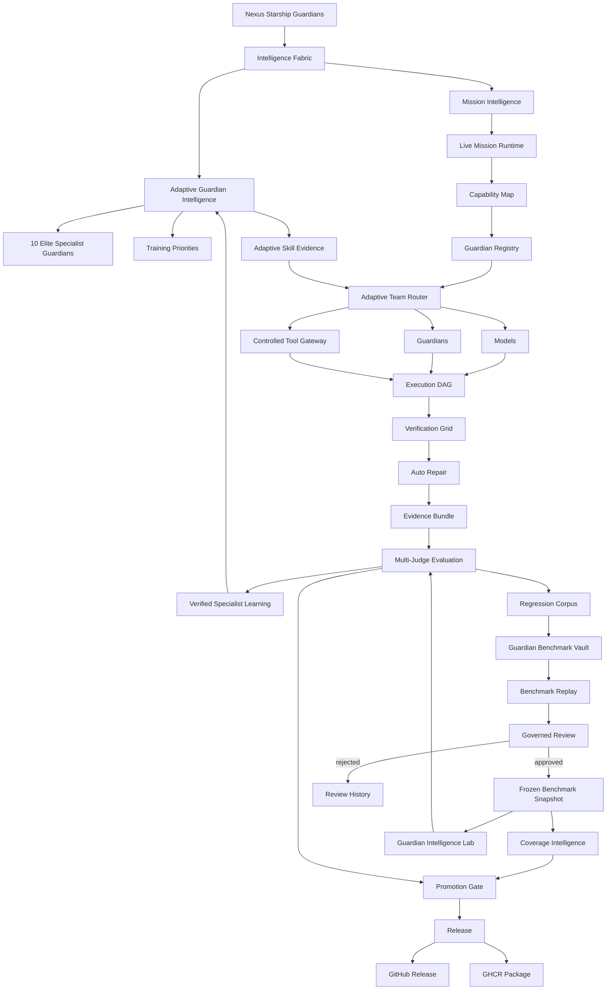

# Nexus Starship Guardians · v0.7.1


**A reusable Guardian engineering runtime for Lucio AI Platform, Ember, Nexus Code, and future applications.** Nexus Starship Guardians coordinates bounded Guardian teams, Intelligence Fabric planning, live adaptive specialist intelligence, permission-safe routing, verified execution, benchmark replay, governed learning, evaluation, regression protection, and distributed work.

## Current State Graph


The Current State Graph is maintained as architecture documentation and changes whenever the runtime flow materially changes. See [`docs/CURRENT_STATE.md`](docs/CURRENT_STATE.md).

## Adaptive Guardian Intelligence


v0.7 introduced a ten-role adaptive specialist intelligence wing, and **v0.7.1 wires that intelligence into the live runtime** so verified specialist outcomes automatically update persistent per-skill evidence used by future routing:

- **AI Architect Guardian**
- **Software Platform Engineer Guardian**
- **AI Developer Guardian**
- **Coder Specialist Guardian**
- **AI Engineer Guardian**
- **Debugger Specialist Guardian**
- **AI Scientist Guardian**
- **AI Cloud Specialist Guardian**
- **API Specialist Guardian**
- **AI Programmer Guardian**

Each specialist can accumulate **verified per-skill evidence**: attempts, successes, quality, benchmark pass rate, recent trend, confidence, and critical-regression pressure. Weak or uncertain capabilities become targeted training priorities. Proven strengths can add only a **bounded routing bonus**; they never grant credentials or tool permissions.

### Automatic verified learning in v0.7.1

The ten elite specialists are now registered in the default live mission registry, the live router receives the persistent adaptive intelligence engine, and terminal specialist runs can update adaptive skill evidence automatically. Successful runs require objective `test`, `api`, `browser`, or `security` tool evidence before they can reinforce specialist expertise. Concrete runtime failures can teach failure evidence automatically. A Guardian merely saying “done” is not considered verification.

Persistent adaptive state defaults to `./data/adaptive_guardian_intelligence.json` and can be configured with `NEXUS_ADAPTIVE_INTELLIGENCE_PATH`.

See [`docs/ADAPTIVE_GUARDIAN_INTELLIGENCE.md`](docs/ADAPTIVE_GUARDIAN_INTELLIGENCE.md).

## Guardian Benchmark Vault


Verified failures can flow from the Regression Corpus into an evidence-linked Benchmark Vault candidate. v0.7 adds **Benchmark Replay** so pending candidates can be rerun against baseline/candidate strategies before governed review. Replay evidence records pass/fail, score, strategy, and failure category. Replay can strengthen review evidence but cannot approve benchmark truth by itself.

Approved candidates can be frozen into a new versioned `FixedEvaluationCorpus` snapshot with its own SHA-256 fingerprint. Rejected candidates remain review history. See [`docs/GUARDIAN_BENCHMARK_VAULT.md`](docs/GUARDIAN_BENCHMARK_VAULT.md).

## Coverage Intelligence

`CoverageIntelligence` measures whether the benchmark is broad enough across:

- architecture;
- platform engineering;
- coding;
- debugging;
- AI/ML;
- evaluation;
- cloud;
- API;
- security;
- database;
- UI;
- deployment;
- tool use;
- reliability.

It produces category counts, critical-case counts, coverage gaps, uncategorized cases, and snapshot-to-snapshot deltas. Coverage gaps can become specialist replay/training targets so Nexus does not over-optimize only for the domains it already tests heavily.

## Current capabilities

- FastAPI REST API with project-scoped authentication and approval gates.
- **Nexus Intelligence Fabric** combining Mission Intelligence, Strategy Engine, Knowledge Graph foundations, Memory Quality, Model Performance Registry, adversarial evaluation, uncertainty, and explicit assumptions.
- **Live Adaptive Guardian Intelligence** with persistent per-skill evidence, trend, confidence, benchmark performance, regression penalties, training priorities, and bounded routing adaptation.
- **Automatic verified specialist learning** from live terminal runs: successful learning requires objective verification evidence; concrete failures can update failure evidence automatically.
- **10-role elite specialist intelligence wing** registered in the live default mission registry, in addition to the canonical 30-Guardian Artificial Architecture team.
- **Live Mission Runtime** that classifies each mission, maps capabilities/tools, selects a bounded Guardian team, and records mission/strategy intelligence before normal REST v1 execution.
- **Controlled Tool Gateway** that keeps permissions explicit. Requirements, model scores, benchmark results, or Guardian performance never grant access by themselves.
- **Guardian Intelligence Lab** for fingerprinted fixed-corpus baseline/candidate evaluation.
- **Guardian Benchmark Vault** for governed benchmark growth from verified regressions.
- **Benchmark Replay Engine** for replaying pending benchmark candidates before review.
- **Coverage Intelligence** for benchmark breadth, category gaps, and snapshot deltas.
- **Multi-Judge Evaluation** with deterministic, Guardian, alternate-model, and evidence judge types.
- **Promotion Gate** blocking corpus mismatch, pass-rate regression, insufficient score gain, critical regression, and optional cost/latency overruns.
- **Failure Taxonomy + Automatic Regression Corpus** with verified-failure capture and deduplication.
- **Guardian Capability Registry + Adaptive Team Router** using capability/tool requirements, historical quality/reliability/cost/latency, and bounded specialist skill evidence.
- **Persistent Guardian Registry metrics** through SQLite.
- **Strategy Tournament** for comparing models, prompts, teams, routing strategies, and repair policies on identical corpora.
- Cross-run learning through episodic memory, reflection, evidence, relevant-lesson retrieval, and memory-quality controls.
- Isolated Git worktrees, parallel coding coordination, structured file editing, automatic diff review, browser/API/unit verification, bounded auto-repair, and SHA-256 evidence bundles.
- Durable SQLite queue for local development plus a **PostgreSQL distributed lease queue** using `FOR UPDATE SKIP LOCKED`, worker leases, heartbeats, retries, and expired-lease recovery.
- **OpenTelemetry HTTP instrumentation foundation** for live API request spans.
- Adaptive swarm coordination for **1–200 logical Guardians** with bounded physical concurrency.
- Reconciled **ChatGPT/Codex plugin v0.7.1** using current Guardian terminology and live automatic verified-learning guidance.
- GitHub-rendered Mermaid diagrams plus animated SVG architecture/process visuals and engineering learnings.

## Architecture



Full visuals: [`docs/CURRENT_STATE.md`](docs/CURRENT_STATE.md), [`docs/ADAPTIVE_GUARDIAN_INTELLIGENCE.md`](docs/ADAPTIVE_GUARDIAN_INTELLIGENCE.md), [`docs/GUARDIAN_BENCHMARK_VAULT.md`](docs/GUARDIAN_BENCHMARK_VAULT.md), and [`docs/VISUAL_GALLERY.md`](docs/VISUAL_GALLERY.md).

## What “automatic learning” means

Nexus automatically learns through **verified evidence**, not unrestricted self-rewriting.

```text
mission
  ↓
specialist Guardian executes
  ↓
objective verification or concrete failure evidence
  ↓
per-skill evidence update
  ↓
confidence + trend + regression analysis
  ↓
training priorities + bounded routing adaptation
  ↓
next mission uses stronger evidence
```

Adaptive learning may change:

- skill evidence;
- confidence;
- training priorities;
- memory quality;
- routing preference;
- benchmark replay evidence;
- coverage-gap priorities.

Adaptive learning does **not** automatically:

- mutate hosted model weights in production;
- grant filesystem, GitHub, cloud, database, deployment, browser, or API permissions;
- approve Benchmark Vault candidates;
- rewrite the immutable core benchmark;
- bypass release/promotion gates;
- treat self-reported success as verified truth.

Optional fine-tuning remains a separate curated offline pipeline with its own dataset and evaluation gates.

## Benchmark truth path

```text
verified failure
    ↓
regression case
    ↓
benchmark candidate
    ↓
benchmark replay
    ↓
replay evidence
    ↓
governed review
  ↙         ↘
reject     approve
             ↓
     versioned snapshot
             ↓
  coverage intelligence
             ↓
   Intelligence Lab
```

## Adaptive routing

`GuardianRegistry` records capability, tool access, success rate, quality, cost, and latency. `AdaptiveGuardianRouter` consumes the live `AdaptiveGuardianIntelligence` state to add a bounded evidence bonus when a specialist has verified strength in the exact capability required by the mission.

Historical performance can influence **selection**, but never **authorization**.

## Permission model

```text
mission requires a tool
        +
project enabled that tool
        +
selected Guardian is allowed that tool
        =
policy permits the adapter to be considered
```

A real external adapter must still authenticate separately. Nexus does not pretend an MCP server, Railway account, Supabase project, browser session, database, or shell is connected merely because a mission would benefit from it.

## Releases and Packages

Nexus Starship Guardians publishes:

- **GitHub Releases** — semantic version, generated release notes, source, Python wheel, and source distribution.
- **GitHub Packages / GHCR** — versioned Docker images such as `ghcr.io/lois4801/nexus-starship-guardians:0.7.1`, plus `0.7` and `latest` aliases.

Release/package automation is defined in [`.github/workflows/release.yaml`](.github/workflows/release.yaml).

## Production verification


Every meaningful change is expected to earn evidence from the applicable compatibility, intelligence, live HTTP, Docker, PostgreSQL, provider-contract, persistence, mission-runtime, adaptive-intelligence, benchmark-replay, coverage, plugin, release-artifact, and learning gates before promotion.

## Quick start

```bash
git clone https://github.com/lois4801/NEXUS-Starship-Guardians.git
cd NEXUS-Starship-Guardians
python -m venv .venv
# PowerShell: .\.venv\Scripts\Activate.ps1
# macOS/Linux: source .venv/bin/activate
pip install -e '.[dev]'
```

```powershell
powershell -ExecutionPolicy Bypass -File .\install.ps1
.\.venv\Scripts\nexus-guardians.exe doctor
```

Example Guardian swarm:

```powershell
.\.venv\Scripts\nexus-guardians.exe swarm `
  --provider ollama `
  --model llama3.2 `
  --guardians 30 `
  "Build, review, test, repair, evaluate, and document this feature"
```

A 200-Guardian mission means up to 200 collaborating logical specialists, not 200 unrestricted shell processes.

## Compatibility contract

**Nexus Starship Guardians** is the canonical product name and `nexus-guardians` is the canonical CLI. To avoid breaking existing integrations, these compatibility surfaces remain supported and tested:

- Python namespace: `nexus_os`
- Legacy CLI alias: `nexus-portable`
- REST v1 wire fields such as `agent` / `agents`
- `NEXUS_*` environment-variable prefix

## Quality gates

```bash
pip install -e '.[dev]'
ruff check nexus_os tests examples
NEXUS_DEV_MODE=true pytest -q
nexus-guardians doctor
nexus-portable doctor
```

GitHub Actions additionally validates Python 3.11/3.12/3.13 compatibility, live API behavior, Uvicorn HTTP, Docker health, PostgreSQL 16 integration, provider contracts, plugin/runtime version alignment, wheel/source-distribution builds, release metadata, Current State Graph presence, Benchmark Vault behavior, Adaptive Guardian Intelligence, automatic verified specialist learning, Benchmark Replay, and Coverage Intelligence.

## Key documentation

- [`docs/CURRENT_STATE.md`](docs/CURRENT_STATE.md)
- [`docs/ADAPTIVE_GUARDIAN_INTELLIGENCE.md`](docs/ADAPTIVE_GUARDIAN_INTELLIGENCE.md)
- [`docs/GUARDIAN_BENCHMARK_VAULT.md`](docs/GUARDIAN_BENCHMARK_VAULT.md)
- [`docs/GUARDIAN_INTELLIGENCE_LAB.md`](docs/GUARDIAN_INTELLIGENCE_LAB.md)
- [`docs/INTELLIGENCE_FABRIC.md`](docs/INTELLIGENCE_FABRIC.md)
- [`docs/LIVE_MISSION_RUNTIME.md`](docs/LIVE_MISSION_RUNTIME.md)
- [`docs/VISUAL_GALLERY.md`](docs/VISUAL_GALLERY.md)
- [`docs/PROCESS_WORKFLOWS.md`](docs/PROCESS_WORKFLOWS.md)
- [`docs/PRODUCTION_VERIFICATION.md`](docs/PRODUCTION_VERIFICATION.md)
- [`docs/RELEASES_AND_PACKAGES.md`](docs/RELEASES_AND_PACKAGES.md)
- [`docs/COMPATIBILITY_AND_PRODUCTION_VERIFICATION.md`](docs/COMPATIBILITY_AND_PRODUCTION_VERIFICATION.md)
- [`docs/MULTI_JUDGE_EVALUATION.md`](docs/MULTI_JUDGE_EVALUATION.md)
- [`docs/REGRESSION_CORPUS.md`](docs/REGRESSION_CORPUS.md)
- [`docs/GUARDIAN_REGISTRY.md`](docs/GUARDIAN_REGISTRY.md)
- [`docs/ADAPTIVE_ROUTING.md`](docs/ADAPTIVE_ROUTING.md)
- [`docs/DISTRIBUTED_EXECUTION.md`](docs/DISTRIBUTED_EXECUTION.md)
- [`docs/SELF_LEARNING_GUARDIANS.md`](docs/SELF_LEARNING_GUARDIANS.md)
- [`docs/LEARNINGS_AND_RETROSPECTIVE.md`](docs/LEARNINGS_AND_RETROSPECTIVE.md)

## Roadmap

1. **Foundation:** secure project runtime, provider adapters, SDKs, CI.
2. **Execution + Learning:** 30/200-Guardian coordination, worktrees, verification, repair, evidence, cross-run memory.
3. **Intelligence + Routing:** Intelligence Fabric, multi-judge evaluation, model/Guardian registries, adaptive routing, distributed execution.
4. **Governed benchmark learning:** fixed corpora, Guardian Intelligence Lab, regression nomination, Benchmark Vault review, versioned snapshots.
5. **Adaptive specialist intelligence — v0.7.1:** live ten-role specialist routing, automatic verified per-skill learning, Benchmark Replay, Coverage Intelligence, targeted training priorities, and evidence-aware routing.
6. **Next intelligence wave:** repository ingestion into the Knowledge Graph, context compression/relevance scoring, hypothesis-driven debugging, causal failure graphs, and governed model-router integration.
7. **v1.0:** security/tenancy audit, governed release/rollback automation, authenticated external-tool adapters, and curated offline model-improvement pipeline.
