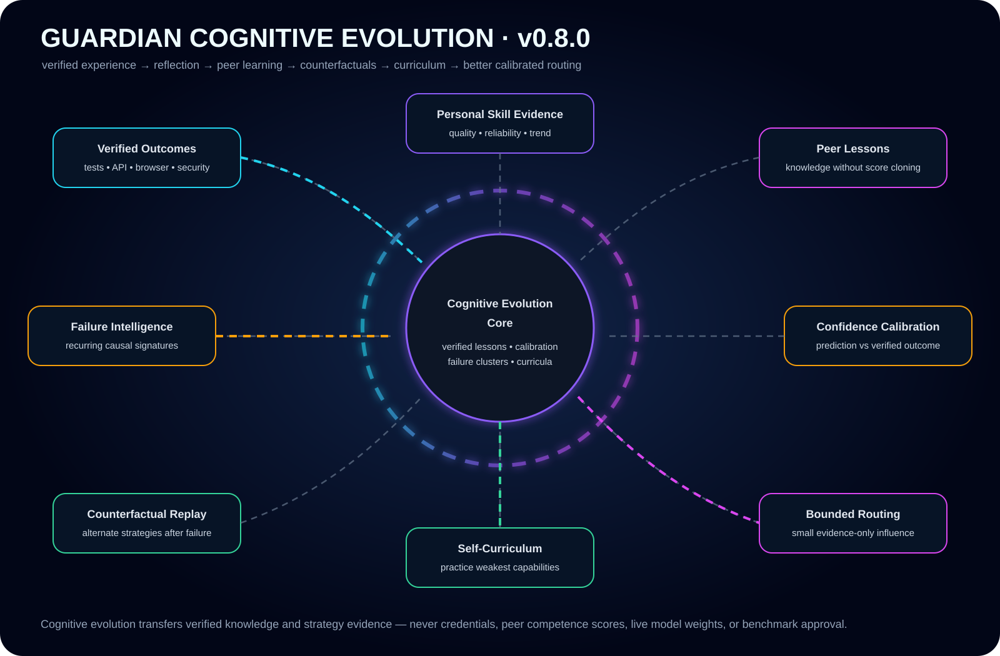
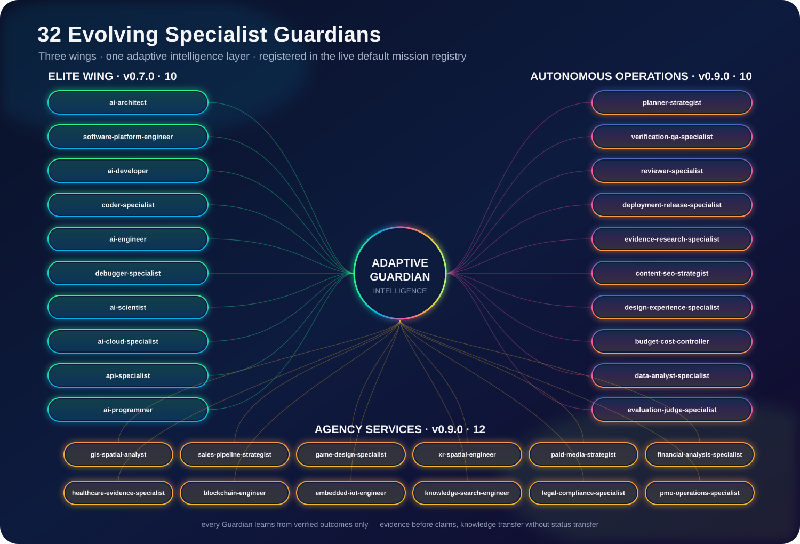
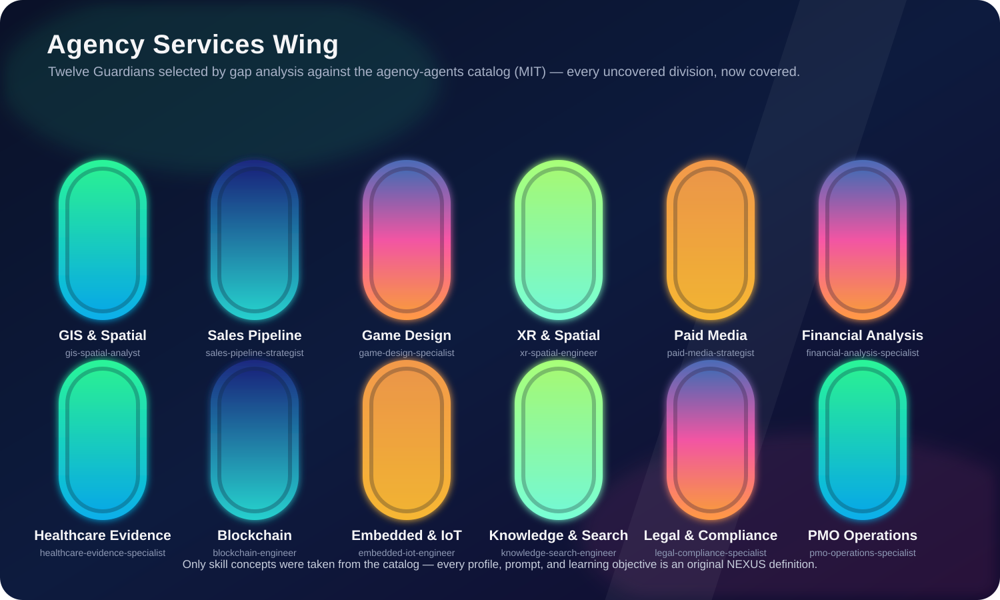
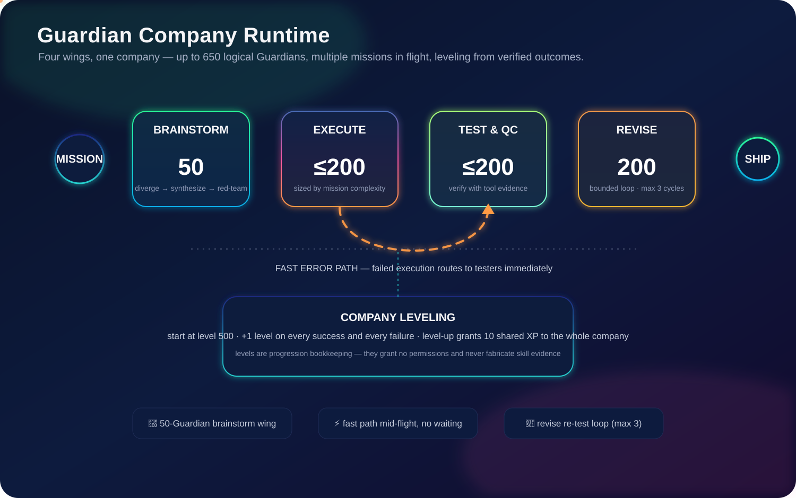
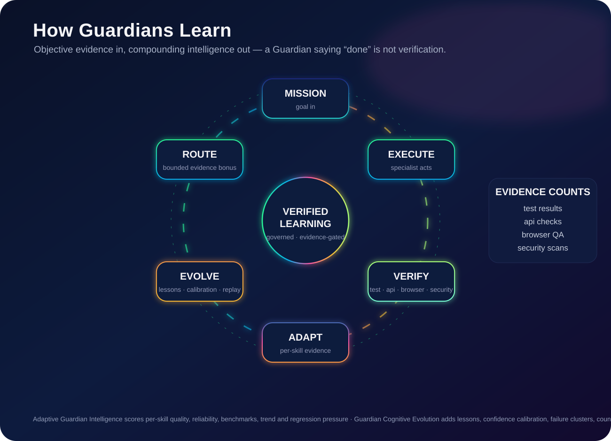
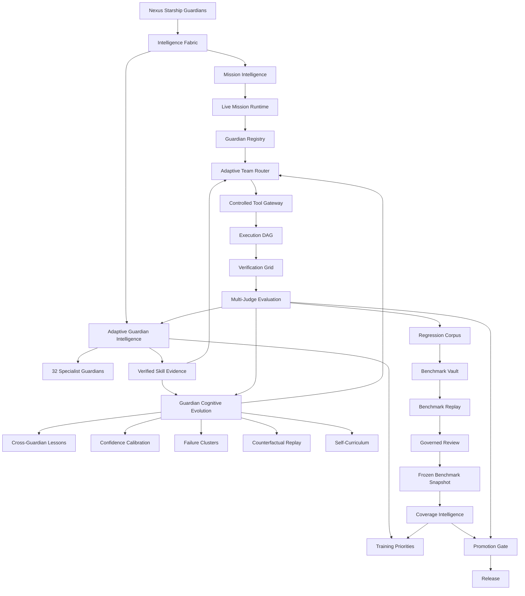

# Nexus Starship Guardians · v0.9.0

[](https://nexusstarshipguardians.kimi.page)

**[🌐 Open the live website →](https://nexusstarshipguardians.kimi.page)** — one cinematic page: smooth scrolling, animated type, the 650-Guardian company, the 32-specialist roster.

**A reusable Guardian engineering runtime for Lucio AI Platform, Ember, Nexus Code, and future applications.** Nexus coordinates bounded Guardian teams, Intelligence Fabric planning, live adaptive specialist intelligence, Guardian Cognitive Evolution, permission-safe routing, verified execution, benchmark replay, governed learning, evaluation, regression protection, and distributed work.

| | | | |
|---|---|---|---|
| **32** specialist Guardians | **650** logical company Guardians | **4** coordinated wings | **1–200** adaptive swarm |


## Current State Graph


The Current State Graph is maintained as architecture documentation and changes whenever the runtime flow materially changes. See [`docs/CURRENT_STATE.md`](docs/CURRENT_STATE.md).

## Guardian Cognitive Evolution



**v0.8.0 made the ten specialist Guardians compound intelligence from verified experience** — and all 32 specialists (v0.9.0) inherit the same cognitive layer. It adds a persistent meta-learning layer above direct per-skill adaptive evidence:


- verified cross-Guardian lesson transfer;
- confidence calibration against real outcomes;
- recurring failure-signature clustering;
- automatic counterfactual replay strategies after verified failures;
- personalized self-training curricula;
- bounded cognitive evidence in Guardian routing;
- live cognitive summaries for inspection and audit.

Peer learning transfers **knowledge, not status**. A Guardian may learn a verified pattern discovered by another specialist, but it does not inherit the other Guardian's success rate, benchmark score, confidence, permissions, or routing authority. It must prove the capability itself.

See [`docs/GUARDIAN_COGNITIVE_EVOLUTION.md`](docs/GUARDIAN_COGNITIVE_EVOLUTION.md).

## Thirty-two evolving specialist Guardians



Original specialist wing (v0.7.0):

- **AI Architect Guardian** — architecture, systems design, AI architecture, tradeoffs, integration design.
- **Software Platform Engineer Guardian** — platform engineering, distributed systems, reliability, deployment, observability.
- **AI Developer Guardian** — AI application development, RAG, model integration, prompt engineering, Guardian workflows.
- **Coder Specialist Guardian** — implementation, refactoring, code review, testing.
- **AI Engineer Guardian** — production AI, inference, evaluation, model routing, performance.
- **Debugger Specialist Guardian** — debugging, root-cause analysis, regression analysis, repair.
- **AI Scientist Guardian** — experiments, statistics, benchmark design, evaluation.
- **AI Cloud Specialist Guardian** — cloud, containers, deployment, scaling, infrastructure, observability.
- **API Specialist Guardian** — API contracts, authentication, integration, retries, testing.
- **AI Programmer Guardian** — programming, automation, algorithms, tool use, testing.

The canonical 30-Guardian Artificial Architecture team remains available; the specialist wings are additional adaptive layers.

## Autonomous Operations Wing (v0.9.0)

Ten more specialist Guardians, acquired from the fleet owner's other repositories and deployable autonomously through the same adaptive-intelligence, mission-routing, and OpenCode subagent surfaces:

- **Planner Strategist Guardian** — goal decomposition, task routing, decision rules, prioritization, success criteria, trade-offs. *(LucioDigital-Platform Dev Agent planner + Lucio strategy squad)*
- **Verification & QA Specialist Guardian** — independent verification, quality audits, browser QA, verbatim evidence capture, bounded self-heal repair. *(LucioDigital QA / Browser QA / self-heal phases)*
- **Independent Reviewer Guardian** — change-set review against goal + verification evidence, evidence-gated approval, scope control; holds gates, never implementation authority. *(LucioDigital Reviewer role, upgraded from the coder wing's generic code-review)*
- **Deployment & Release Guardian** — preview environments, staged promotion, release gates, rollback plans. *(LucioDigital deployment control phases)*
- **Evidence & Research Guardian** — provenance-carrying research, evidence scoring, source verification, fact-checking before building. *(Lucio-AI-Platform research/evidence squad + evidence-first verification)*
- **Content & SEO Strategist Guardian** — structured content, keyword intent, conversion copy from verified facts only. *(Lucio content/SEO squad)*
- **Design Experience Guardian** — design systems, style universes, motion design, accessibility, design QA. *(Lucio design/style/motion/cinematic squad)*
- **Budget & Cost Controller Guardian** — resource budgets, model routing, cost per verified mission, failure-taxonomy accounting. *(Lucio budget squad + bounded agent-run budgets)*
- **Data & SQL Analyst Guardian** — SQL and ETL analysis, data-quality checks, dashboard verification, BI reporting. *(Multi-Agent AI System SQL tool agents + the fleet owner's SQL/BI work-case repos)*
- **Evaluation Judge Guardian** — LLM-as-judge correctness grading, trajectory evaluation, benchmark evaluation. *(Multi-Agent AI System evaluation patterns)*

The Anonato-Code repository was surveyed and deliberately excluded as an acquisition source: it archives leaked proprietary source code, so no code, text, or agent definitions were taken from it.

## Agency Services Wing (v0.9.0)

Twelve more specialist Guardians, selected by gap analysis against the open agency-agents catalog (msitarzewski/agency-agents, MIT License): every catalog division with no existing Guardian coverage is represented. Only skill concepts were taken from the catalog — all profiles, prompts, and learning objectives are original NEXUS definitions. They deploy through the same adaptive-intelligence, mission-routing, and OpenCode subagent surfaces as the other wings:



- **GIS & Spatial Analyst Guardian** — geospatial analysis, spatial data, cartography, geoprocessing, remote sensing, GeoAI.
- **Sales Pipeline Strategist Guardian** — pipeline management, deal strategy, proposal writing, lead qualification, sales coaching.
- **Game Design Guardian** — game design, level design, narrative design, economy design, game audio, technical art.
- **XR & Spatial Computing Guardian** — XR development, spatial computing, immersive interfaces, visionOS, Metal, 3D interaction.
- **Paid Media Strategist Guardian** — paid media, PPC, programmatic, paid social, ad tracking, media audits.
- **Financial Analysis Guardian** — financial analysis, FP&A, bookkeeping, investment research, tax strategy, financial modeling.
- **Healthcare Evidence Guardian** — healthcare analysis, clinical evidence, health innovation, health systems, medical compliance.
- **Blockchain Engineer Guardian** — blockchain, smart contracts, Solidity, ZK proofs, DeFi, chain security.
- **Embedded & IoT Guardian** — embedded systems, firmware, IoT, edge computing, hardware integration.
- **Knowledge & Search Guardian** — knowledge graphs, search relevance, RAG, information retrieval, embeddings.
- **Legal & Compliance Guardian** — legal analysis, contract review, compliance audits, privacy law, regulatory affairs.
- **PMO Operations Guardian** — project management, meeting operations, status reporting, studio operations, workflow coordination.

## Guardian Company Runtime

`nexus-guardians company` runs missions the way a company runs the whole business — four wings working together, with multiple missions in flight at once:



- **Brainstorm wing (50 Guardians)** — diverge → lead synthesis → full-wing red-team critique → refined plan. The requestor's goal is the floor, not the ceiling.
- **Execution wing (up to 200 Guardians)** — sized by mission complexity; implements the approved plan in parallel.
- **Test & QC wing (up to 200 Guardians)** — sized by mission complexity; verifies the work product. **Fast error path:** the moment an execution Guardian fails, it is routed to testers immediately — no waiting for the phase to finish.
- **Revision wing (200 Guardians)** — when QC confirms defects, the wing re-implements the revised plan and the result is re-tested, up to 3 bounded cycles.

Every positional argument to `company` is a separate task; tasks run concurrently against one shared company:

```bash
nexus-guardians company --provider opencode \
  "Build the landing page" "Write the API docs" "Fix the checkout bug"
```

**Company leveling.** Every company Guardian starts at **level 500** — the accumulated fleet-experience baseline imported at founding. After that, Guardians level up only from verified swarm outcomes: every success grants +1 level, every failure grants +1 level (failures teach), and **whenever any Guardian levels up, the entire company receives shared experience** (10 XP per level-up; 100 XP settles into one level). Leveling is progression bookkeeping over verified outcomes — it grants no permissions (authorization stays in the Controlled Tool Gateway) and never fabricates adaptive skill evidence, which still requires objective test/api/browser/security verification. Fully scaled, the company fields **650 logical Guardians** (50 + 200 + 200 + 200); physical concurrency stays bounded by `--max-parallel`.


## How automatic learning works



```text
mission
  ↓
specialist Guardian executes
  ↓
objective verification or concrete failure evidence
  ↓
Adaptive Guardian Intelligence
  ├─ per-skill score
  ├─ reliability / benchmark evidence
  ├─ confidence / trend
  └─ training priorities
  ↓
Guardian Cognitive Evolution
  ├─ reusable verified lesson
  ├─ confidence calibration
  ├─ recurring failure cluster
  ├─ counterfactual replay plan
  └─ self-training curriculum
  ↓
bounded adaptive + cognitive routing
  ↓
next mission
```

Successful runs require objective `test`, `api`, `browser`, or `security` evidence before they can reinforce specialist expertise. Concrete runtime failures can teach failure evidence automatically. A Guardian merely saying “done” is not verification.

## Cognitive inspection API

```text
GET /v1/projects/{project_id}/guardians/{guardian_id}/cognitive-summary
```

The response combines direct adaptive competence with higher-order cognition: verified episodes, authored lessons, confidence reliability, counterfactual cycle count, and the current curriculum.

Persistent state defaults to:

```text
./data/adaptive_guardian_intelligence.json
./data/guardian_cognitive_evolution.json
```

and can be configured with `NEXUS_ADAPTIVE_INTELLIGENCE_PATH` and `NEXUS_COGNITIVE_EVOLUTION_PATH`.

## Benchmark Replay + Coverage Intelligence

Verified regressions can become evidence-linked Benchmark Vault candidates. `BenchmarkReplayEngine` replays candidates before governed review, while `CoverageIntelligence` measures benchmark breadth across architecture, platform engineering, coding, debugging, AI/ML, evaluation, cloud, API, security, database, UI, deployment, tool use, and reliability.

Coverage gaps become evidence for future specialist replay and curriculum priorities. Replay strengthens review evidence but never approves benchmark truth by itself.

See [`docs/GUARDIAN_BENCHMARK_VAULT.md`](docs/GUARDIAN_BENCHMARK_VAULT.md) and [`docs/ADAPTIVE_GUARDIAN_INTELLIGENCE.md`](docs/ADAPTIVE_GUARDIAN_INTELLIGENCE.md).

## Current capabilities

- FastAPI REST API with project-scoped authentication and approval gates.
- **Nexus Intelligence Fabric** for mission classification, strategy, uncertainty, assumptions, model evidence, and adversarial evaluation.
- **Adaptive Guardian Intelligence** for verified per-skill quality, reliability, benchmark evidence, trend, regression pressure, and training priorities.
- **Guardian Cognitive Evolution** for verified lessons, peer knowledge transfer, confidence calibration, failure intelligence, counterfactual replay, and self-curricula.
- **32-role specialist wing** — the 10 elite specialists (v0.7.0), the 10-role Autonomous Operations Wing (v0.9.0), and the 12-role Agency Services Wing (v0.9.0) — registered in the live default mission registry, alongside the canonical 30-Guardian Artificial Architecture team.
- **Adaptive Team Router** combining registry utility, bounded direct skill evidence, and a smaller bounded cognitive signal.
- **Controlled Tool Gateway** keeping authorization separate from intelligence and performance.
- **Guardian Intelligence Lab**, Multi-Judge Evaluation, Promotion Gate, Regression Corpus, Guardian Benchmark Vault, Benchmark Replay, and Coverage Intelligence.
- Isolated Git worktrees, parallel coding coordination, structured editing, diff review, browser/API/unit verification, bounded auto-repair, and SHA-256 evidence bundles.
- Durable SQLite execution plus PostgreSQL distributed lease-queue foundations.
- OpenTelemetry HTTP instrumentation foundation.
- Adaptive swarm coordination for **1–200 logical Guardians** with bounded physical concurrency.
- **Guardian Company Runtime** — `nexus-guardians company` runs one or more missions concurrently through four wings: 50-Guardian brainstorm, up to 200 complexity-sized execution, up to 200 complexity-sized test/QC with an immediate fast path for execution failures, and a 200-Guardian revision wing in a bounded revise/re-test loop (max 3 cycles).
- **Guardian brainstorm mode** — `nexus-guardians brainstorm` runs the 50-Guardian company brainstorm wing through a divergent-convergent pipeline: independent idea generation with an exceed-expectations mandate, lead synthesis into a candidate plan, a full-wing red-team critique pass, and a refined final plan with verification gates.
- **Company leveling** — every company Guardian starts at level 500, levels up on every verified success and failure, and grants shared experience to the whole company on each level-up; levels grant progression, never permissions.
- **OpenCode CLI provider** for free/local desktop execution — run Guardian swarms through the open-source [OpenCode](https://opencode.ai) agent with any of its 75+ model providers, including free tiers, via `nexus-guardians swarm --provider opencode`. See [`docs/OPENCODE_PROVIDER.md`](docs/OPENCODE_PROVIDER.md).
- ChatGPT/Codex plugin v0.9.0 aligned with runtime terminology and governance.

## Architecture



## What “super-Guardian” means

Nexus does **not** call unrestricted live model-weight rewriting intelligence. A super-Guardian is a specialist whose decisions compound from verified experience: it remembers what worked, recognizes recurring failures, gets better calibrated about uncertainty, tests alternate strategies, learns relevant peer lessons, practices weak capabilities, and lets that evidence influence future routing.

Automatic learning may adapt evidence, lessons, calibration, failure clusters, curricula, replay strategies, memory, and bounded routing preference. It may **not** automatically:

- mutate hosted model weights in production;
- grant filesystem, GitHub, cloud, database, deployment, browser, API, or model permissions;
- copy another Guardian's competence score;
- approve Benchmark Vault candidates;
- overwrite a frozen benchmark corpus;
- bypass promotion/release gates;
- treat self-reported success as verified truth.

Optional fine-tuning remains a separate curated offline pipeline with its own dataset and evaluation gates.

## Releases and Packages

Nexus publishes GitHub Releases with source, wheel, and sdist plus GHCR images such as:

```text
ghcr.io/lois4801/nexus-starship-guardians:0.9.0
ghcr.io/lois4801/nexus-starship-guardians:0.9
ghcr.io/lois4801/nexus-starship-guardians:latest
```

Release/package automation is defined in [`.github/workflows/release.yaml`](.github/workflows/release.yaml).

## Quick start

```bash
git clone https://github.com/lois4801/NEXUS-Starship-Guardians.git
cd NEXUS-Starship-Guardians
python -m venv .venv
# PowerShell: .\.venv\Scripts\Activate.ps1
# macOS/Linux: source .venv/bin/activate
pip install -e '.[dev]'
```

```powershell
.\.venv\Scripts\nexus-guardians.exe doctor
```

Example swarm:

```powershell
.\.venv\Scripts\nexus-guardians.exe swarm `
  --provider ollama `
  --model llama3.2 `
  --guardians 30 `
  "Build, review, test, repair, evaluate, and document this feature"
```

A 200-Guardian mission means up to 200 collaborating logical Guardians, not 200 unrestricted shell processes.

## Compatibility contract

The canonical product name is **Nexus Starship Guardians** and the canonical CLI is `nexus-guardians`. Compatibility surfaces remain supported and tested:

- Python namespace `nexus_os`;
- legacy CLI alias `nexus-portable`;
- REST v1 wire fields such as `agent` / `agents`;
- `NEXUS_*` environment-variable prefix.

## Quality gates

```bash
pip install -e '.[dev]'
ruff check nexus_os tests examples
NEXUS_DEV_MODE=true pytest -q
nexus-guardians doctor
nexus-portable doctor
```

GitHub Actions additionally validates Python 3.11/3.12/3.13, live HTTP, Docker health, PostgreSQL 16 integration, provider contracts, persistence, mission routing, adaptive/cognitive learning, benchmark replay, coverage intelligence, plugin/runtime alignment, and release artifacts.

## Website

A premium single-page site lives at [`docs/index.html`](docs/index.html) — hero key art, animated capability counters, the company pipeline, the full 32-Guardian roster, the verified learning loop, and the compatibility contract, all matching this README. Serve it with GitHub Pages (Repository **Settings → Pages → Build and deployment → GitHub Actions / docs folder**) or open it locally:

```bash
python -m http.server -d docs 8000
# → http://localhost:8000
```

## Key documentation

- [`docs/CURRENT_STATE.md`](docs/CURRENT_STATE.md)
- [`docs/GUARDIAN_COGNITIVE_EVOLUTION.md`](docs/GUARDIAN_COGNITIVE_EVOLUTION.md)
- [`docs/ADAPTIVE_GUARDIAN_INTELLIGENCE.md`](docs/ADAPTIVE_GUARDIAN_INTELLIGENCE.md)
- [`docs/GUARDIAN_BENCHMARK_VAULT.md`](docs/GUARDIAN_BENCHMARK_VAULT.md)
- [`docs/GUARDIAN_INTELLIGENCE_LAB.md`](docs/GUARDIAN_INTELLIGENCE_LAB.md)
- [`docs/INTELLIGENCE_FABRIC.md`](docs/INTELLIGENCE_FABRIC.md)
- [`docs/LIVE_MISSION_RUNTIME.md`](docs/LIVE_MISSION_RUNTIME.md)
- [`docs/PRODUCTION_VERIFICATION.md`](docs/PRODUCTION_VERIFICATION.md)
- [`docs/RELEASES_AND_PACKAGES.md`](docs/RELEASES_AND_PACKAGES.md)
- [`docs/VISUAL_GALLERY.md`](docs/VISUAL_GALLERY.md) — every graph and key-art image, including the animated v0.9.0 motion graphics

## Roadmap

1. **Foundation:** secure project runtime, provider adapters, SDKs, CI.
2. **Execution + Learning:** Guardian coordination, worktrees, verification, repair, evidence, cross-run memory.
3. **Intelligence + Routing:** Intelligence Fabric, evaluation, registries, adaptive routing, distributed execution.
4. **Governed benchmark learning:** fixed corpora, regression nomination, Benchmark Vault review, versioned snapshots.
5. **Adaptive specialist intelligence — v0.7:** live verified per-skill learning, Benchmark Replay, Coverage Intelligence.
6. **Guardian Cognitive Evolution — v0.8:** meta-learning, cross-Guardian lessons, confidence calibration, failure intelligence, counterfactual replay, self-curricula.
7. **Next intelligence wave:** repository Knowledge Graph ingestion, context compression/relevance scoring, causal failure graphs, governed model-router integration.
8. **v1.0:** security/tenancy audit, governed release/rollback automation, authenticated external-tool adapters, curated offline model-improvement pipeline.
