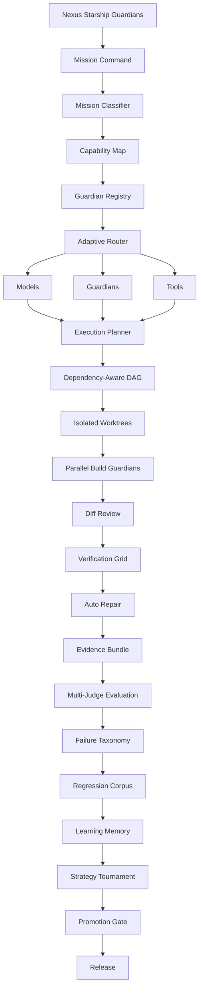

# Nexus Starship Guardians · v0.3-dev


**A reusable Guardian engineering runtime for Lucio AI Platform, Ember, Nexus Code, and future applications.** Nexus Starship Guardians coordinates bounded Guardian teams, verified execution, learning memory, evaluation, regression protection, adaptive routing, and increasingly distributed work.

## Current capabilities

- FastAPI REST API with project-scoped authentication and approval gates.
- Portable local/CLI runtime for Ollama and authenticated coding/chat CLIs.
- Adaptive swarm coordination for **1–200 logical Guardians** with bounded physical concurrency.
- Canonical **30-Guardian Artificial Architecture team**.
- Cross-run learning through episodic memory, reflection, evidence, and relevant-lesson retrieval.
- Isolated Git worktrees, parallel coding coordination, structured file editing, and automatic diff review.
- Browser/API/unit verification, bounded auto-repair, SHA-256 evidence bundles, and safe rebase/conflict handling.
- **Guardian Intelligence Lab** for fixed-corpus baseline/candidate evaluation.
- **Multi-Judge Evaluation** with deterministic, Guardian, alternate-model, and evidence judge types.
- **Promotion Gate** that blocks pass-rate regressions, insufficient score gains, critical regressions, and optional cost/latency overruns.
- **Failure Taxonomy + Automatic Regression Corpus** with verified-failure capture and deduplication.
- **Guardian Capability Registry + Adaptive Router** using capability/tool requirements and historical quality/reliability/cost/latency evidence.
- **Persistent Guardian Registry metrics** through SQLite so routing history survives process restarts.
- **Strategy Tournament** for comparing models, prompts, team structures, routing strategies, and repair policies on the same corpus.
- Durable SQLite queue for local development plus a **PostgreSQL distributed lease queue** using `FOR UPDATE SKIP LOCKED`, worker leases, heartbeats, retries, and expired-lease recovery.
- **OpenTelemetry HTTP instrumentation foundation** for live API request spans.
- CI compatibility matrix for **Python 3.11, 3.12, and 3.13**, canonical/legacy CLI smoke tests, live Uvicorn HTTP verification, Docker build/start/health verification, REST checks, and a real **PostgreSQL 16** service integration test.
- GitHub-rendered Mermaid diagrams plus animated SVG architecture/process visuals and a permanent engineering learnings/retrospective log.

## Production verification


Every meaningful change is expected to earn evidence from the applicable compatibility, live HTTP, Docker, PostgreSQL, provider-contract, persistence, and learning gates before promotion. See [`docs/PRODUCTION_VERIFICATION.md`](docs/PRODUCTION_VERIFICATION.md).

## Architecture



Full visuals: [`docs/ARCHITECTURE_VISUALS.md`](docs/ARCHITECTURE_VISUALS.md), [`docs/PROCESS_WORKFLOWS.md`](docs/PROCESS_WORKFLOWS.md), and [`docs/VISUAL_GALLERY.md`](docs/VISUAL_GALLERY.md).

## Quick start

```bash
git clone https://github.com/lois4801/NEXUS-Starship-Guardians.git
cd NEXUS-Starship-Guardians
python -m venv .venv
# PowerShell: .\.venv\Scripts\Activate.ps1
# macOS/Linux: source .venv/bin/activate
pip install -e '.[dev]'
```

```powershell
powershell -ExecutionPolicy Bypass -File .\install.ps1
.\.venv\Scripts\nexus-guardians.exe doctor
```

Example Guardian swarm:

```powershell
.\.venv\Scripts\nexus-guardians.exe swarm `
  --provider ollama `
  --model llama3.2 `
  --guardians 30 `
  "Build, review, test, repair, evaluate, and document this feature"
```

A 200-Guardian mission means up to 200 collaborating logical specialists, not 200 unrestricted shell processes.

## Compatibility contract

**Nexus Starship Guardians** is the canonical product name and `nexus-guardians` is the canonical CLI.

To avoid breaking existing integrations during the migration, these technical compatibility surfaces remain supported and tested:

- Python namespace: `nexus_os`
- Legacy CLI alias: `nexus-portable`
- Existing REST v1 wire fields such as `agent` / `agents`
- Existing `NEXUS_*` environment-variable prefix

These are compatibility interfaces, not the current product name. Removing them requires a versioned migration and regression coverage. See [`docs/COMPATIBILITY_AND_PRODUCTION_VERIFICATION.md`](docs/COMPATIBILITY_AND_PRODUCTION_VERIFICATION.md).

## Learning and evaluation

Automatic Guardian learning means **memory + reflection + evaluation**, not live production weight mutation. High-quality verified episodes can later be curated for offline SFT/LoRA; a candidate model or strategy should then beat the fixed evaluation baseline before promotion.

The Guardian Intelligence Lab compares candidates on pass rate, score, critical regressions, cost, and latency. Deterministic/evidence failures cannot be hidden by a high semantic score.

`RegressionLearningBridge` only turns verified failure evidence into persistent regression cases. Unsupported suspicions are not promoted into long-term learning truth.

## Adaptive routing

`GuardianRegistry` records capabilities, tool access, success rate, quality, cost, and latency. `AdaptiveGuardianRouter` chooses a bounded team from explicit `MissionRequirements` and reports missing capabilities rather than pretending a team is sufficient.

`SQLiteGuardianRegistry` persists those profiles and performance metrics across process restarts. Historical performance never grants new tool permissions.

## Distributed execution

`PostgresGuardianQueue` implements the PostgreSQL multi-worker contract: queued jobs, `SKIP LOCKED` claims, leases, heartbeats, bounded retries, completion/failure transitions, and expired-lease recovery. The adapter uses an injected DB-API compatible connection factory.

The CI workflow launches a real PostgreSQL 16 service and verifies queue initialization, claim/ownership behavior, heartbeat, completion, and expired-lease recovery.

## Observability

Incoming FastAPI requests create OpenTelemetry spans with service name, request method, path, and response status. Exporters are intentionally deployment-specific rather than hard-coded into the runtime.

## Default repository update standard

Every meaningful Nexus Starship Guardians change should update the applicable repository evidence:

1. code;
2. automated tests;
3. documentation;
4. architecture/process visuals;
5. learnings/retrospective;
6. change log and CI/verification status.

## Quality gates

```bash
pip install -e '.[dev]'
ruff check nexus_os tests examples
NEXUS_DEV_MODE=true pytest -q
nexus-guardians doctor
nexus-portable doctor
```

GitHub Actions additionally validates:

- Python 3.11 / 3.12 / 3.13 compatibility;
- live Uvicorn startup and `/health` over HTTP;
- Docker Compose configuration;
- Docker image build, start and container health;
- PostgreSQL 16 queue behavior;
- deterministic provider contracts.

## Key documentation

- [`docs/VISUAL_GALLERY.md`](docs/VISUAL_GALLERY.md)
- [`docs/ARCHITECTURE_VISUALS.md`](docs/ARCHITECTURE_VISUALS.md)
- [`docs/PROCESS_WORKFLOWS.md`](docs/PROCESS_WORKFLOWS.md)
- [`docs/PRODUCTION_VERIFICATION.md`](docs/PRODUCTION_VERIFICATION.md)
- [`docs/COMPATIBILITY_AND_PRODUCTION_VERIFICATION.md`](docs/COMPATIBILITY_AND_PRODUCTION_VERIFICATION.md)
- [`docs/GUARDIAN_INTELLIGENCE_LAB.md`](docs/GUARDIAN_INTELLIGENCE_LAB.md)
- [`docs/MULTI_JUDGE_EVALUATION.md`](docs/MULTI_JUDGE_EVALUATION.md)
- [`docs/REGRESSION_CORPUS.md`](docs/REGRESSION_CORPUS.md)
- [`docs/GUARDIAN_REGISTRY.md`](docs/GUARDIAN_REGISTRY.md)
- [`docs/ADAPTIVE_ROUTING.md`](docs/ADAPTIVE_ROUTING.md)
- [`docs/DISTRIBUTED_EXECUTION.md`](docs/DISTRIBUTED_EXECUTION.md)
- [`docs/SELF_LEARNING_GUARDIANS.md`](docs/SELF_LEARNING_GUARDIANS.md)
- [`docs/LEARNINGS_AND_RETROSPECTIVE.md`](docs/LEARNINGS_AND_RETROSPECTIVE.md)
- [`docs/CHANGELOG_INTERNAL.md`](docs/CHANGELOG_INTERNAL.md)

## Roadmap

1. **Foundation:** secure project runtime, provider adapters, SDKs, CI.
2. **Execution + Learning:** 30/200-Guardian coordination, worktrees, verification, repair, evidence, cross-run learning.
3. **Intelligence + Routing:** multi-judge evaluation, regression corpus, promotion gates, strategy tournament, Guardian registry, adaptive routing, PostgreSQL distributed queue.
4. **Production verification:** multi-version compatibility, live HTTP, Docker health, PostgreSQL integration, persisted Guardian metrics, verified failure-to-regression wiring, provider contracts, and HTTP tracing.
5. **Next integration wave:** Mission Classifier, alternate-model judge adapters, queue/mission telemetry, persistent cross-project metrics, and gated Railway/Supabase/MCP/Lucio/Ember/Nexus Code integration tests.
6. **v1.0:** security/tenancy audit, governed release/rollback automation, and curated offline model-improvement pipeline.
