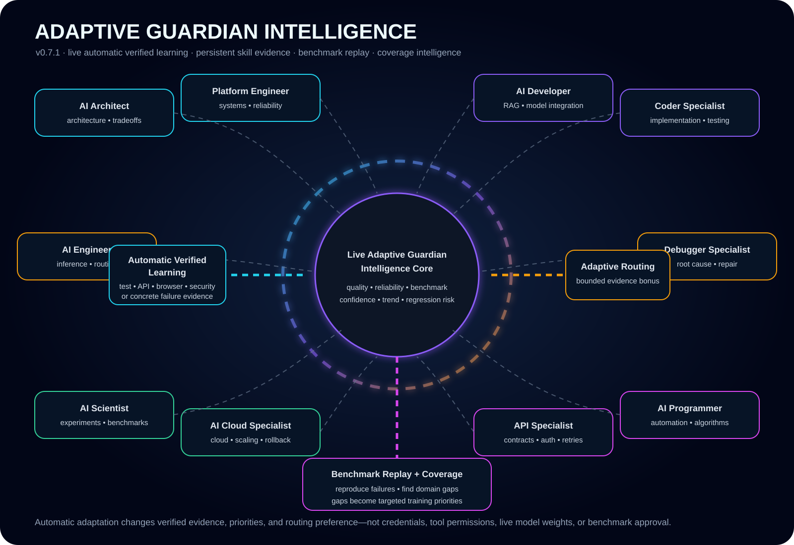

# Adaptive Guardian Intelligence

Adaptive Guardian Intelligence is the specialist-learning layer for Nexus Starship Guardians. v0.7 introduced the evidence model; **v0.7.1 activates it in the live API/runtime path** so specialist Guardians can become increasingly evidence-driven across real missions without pretending that production model weights retrain themselves automatically.



## Specialist intelligence wing

The live default Guardian Registry includes ten adaptive specialist profiles:

1. **AI Architect Guardian** — architecture, systems design, AI architecture, tradeoff analysis, integration design.
2. **Software Platform Engineer Guardian** — platform engineering, distributed systems, reliability, deployment, observability.
3. **AI Developer Guardian** — AI application development, RAG, Guardian workflows, model integration, prompt engineering.
4. **Coder Specialist Guardian** — coding, refactoring, implementation, code review, testing.
5. **AI Engineer Guardian** — production AI, inference, evaluation, model routing, reliability and performance.
6. **Debugger Specialist Guardian** — debugging, root-cause analysis, regression analysis, repair, testing.
7. **AI Scientist Guardian** — research, experiments, statistics, benchmark design, evaluation.
8. **AI Cloud Specialist Guardian** — cloud, containers, deployment, scaling, infrastructure, observability.
9. **API Specialist Guardian** — API design, contracts, authentication, integration, testing.
10. **AI Programmer Guardian** — programming, automation, algorithms, tool use, testing.

The canonical 30-Guardian Artificial Architecture team remains available. The ten-role specialist wing is an additional evidence-driven layer rather than a breaking replacement.

## Live persistence

The API runtime creates one persistent `AdaptiveGuardianIntelligence` store and supplies it to both the live `MissionRuntime` and `ServerLearningRecorder`.

Default path:

```text
./data/adaptive_guardian_intelligence.json
```

Override with:

```text
NEXUS_ADAPTIVE_INTELLIGENCE_PATH=/path/to/adaptive_guardian_intelligence.json
```

This allows specialist evidence to survive process restarts rather than resetting with every server run.

## What automatically learns

`AdaptiveGuardianIntelligence` stores per-skill verified evidence. A skill can accumulate:

- attempts;
- successes;
- average quality score;
- benchmark passes and failures;
- critical regressions;
- recent score history;
- confidence;
- recent performance trend.

The resulting adaptive score combines quality, reliability, benchmark performance, trend, and critical-regression penalties. This is deliberately interpretable rather than an opaque self-modification mechanism.

## Automatic verified learning

Adaptive specialist learning rejects unsupported success claims. In v0.7.1 the live server recorder automatically feeds specialist outcomes into the adaptive engine when sufficient evidence exists.

```text
mission
  ↓
specialist Guardian executes
  ↓
terminal outcome
  ↓
objective verification or concrete failure evidence
  ↓
automatic record_verified_outcome(...)
  ↓
per-skill evidence changes
  ↓
training priorities + bounded routing bonus
  ↓
future missions can use stronger evidence
```

For a **successful** run, automatic adaptive learning requires a successful tool result from one of the verification surfaces currently recognized by the server path:

- `test`
- `api`
- `browser`
- `security`

For a **failed** run, a concrete recorded failure such as provider error, policy denial, tool error, or max-step exhaustion is evidence that can update failure-side specialist learning.

A Guardian merely returning a final answer such as “done” is not enough to reinforce its expertise.

Mission capabilities recorded in the `mission_intelligence` event become the per-skill evidence targets. If a recognized specialist has no recorded mission capabilities, its declared profile capabilities are used as the fallback.

## Training priorities

Each specialist profile has explicit capabilities. `training_priorities()` ranks weak or uncertain capabilities using:

- low adaptive score;
- low confidence / insufficient observations;
- declining recent trend;
- critical-regression pressure.

This gives Nexus a concrete answer to: **what should this specialist practice or replay next?**

A skill with no evidence is treated as uncertain, not automatically strong. A skill with repeated critical regressions is deliberately penalized even if its average semantic score is high.

## Adaptive routing

The live `MissionRuntime` now creates `AdaptiveGuardianRouter` with the persistent `AdaptiveGuardianIntelligence` instance.

The existing Guardian Registry utility still considers verified quality, reliability, cost, and latency. The adaptive layer adds only a **bounded specialist evidence bonus** for required capabilities with direct per-skill evidence.

Important invariant:

```text
performance evidence ≠ authorization
```

A high-performing Guardian does not gain a filesystem, GitHub, shell, cloud, browser, database, deployment, or API permission. Tool access still comes from explicit Guardian allowlists, project configuration, the Controlled Tool Gateway, and real adapter authentication.

## Benchmark Replay

`BenchmarkReplayEngine` replays Benchmark Vault candidates before governed review.

For each replay it records:

- strategy;
- pass/fail;
- score;
- failure category;
- replay count;
- candidate replay pass rate.

A candidate can therefore be reviewed with evidence that answers whether the failure reproduces under the baseline, candidate strategy, or other selected strategies.

Replay is evidence, not approval. `GuardianBenchmarkVault.review(..., require_replay=True)` can enforce that a candidate has replay evidence before approval, but replay itself cannot approve a candidate.

## Coverage Intelligence

`CoverageIntelligence` measures benchmark breadth across:

- architecture;
- platform engineering;
- coding;
- debugging;
- AI/ML;
- evaluation;
- cloud;
- API;
- security;
- database;
- UI;
- deployment;
- tool use;
- reliability.

It produces category counts, critical-case counts, uncategorized cases, coverage gaps, and snapshot-to-snapshot deltas.

This prevents Nexus from becoming excellent only at the benchmark categories it already sees often. Coverage gaps can become specialist training targets for future replay, regression collection, or curated benchmark expansion.

## What does not automatically change

Adaptive Guardian Intelligence does **not** automatically:

- mutate hosted model weights;
- fine-tune a model in production;
- grant credentials or permissions;
- approve benchmark candidates;
- overwrite the fixed core corpus;
- bypass release or promotion gates;
- treat unverified self-reported success as learning truth.

Optional model fine-tuning remains a separate curated offline process. Nexus can export training candidates, but consequential weight changes should still have their own dataset, evaluation, and promotion controls.

## Practical meaning of “gets smarter”

For Nexus Starship Guardians, automatic intelligence improvement means the live system becomes better at deciding:

- which specialist should handle a particular problem;
- which capabilities are genuinely strong vs merely assumed;
- which specialist needs more replay or evaluation;
- which recurring failure patterns must be avoided;
- which benchmark categories are under-covered;
- which routing choices have produced verified success;
- where confidence is still too low to make strong claims.

That creates a compounding learning system while retaining evidence, governance, and permission boundaries.
