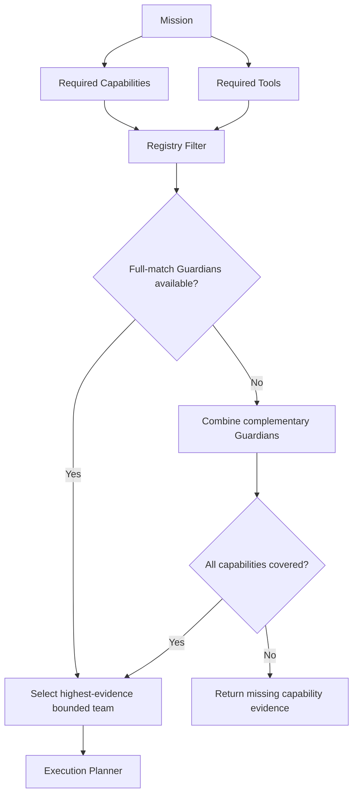

# Adaptive Guardian Routing

`AdaptiveGuardianRouter` turns explicit mission requirements into a bounded Guardian team.

## Inputs

- required capabilities;
- required tools;
- minimum Guardian count;
- maximum Guardian count.

## Behavior

1. Prefer Guardians that individually satisfy the full capability/tool requirement.
2. If that is not possible, combine Guardians whose capabilities cover the mission.
3. Report missing capabilities rather than pretending the team is sufficient.
4. Respect the configured maximum team size (never above 200 logical Guardians).

## Next evolution

The explicit requirement object is intentionally deterministic. A future Mission Classifier can propose requirements, but that proposal should remain inspectable and testable before routing.
