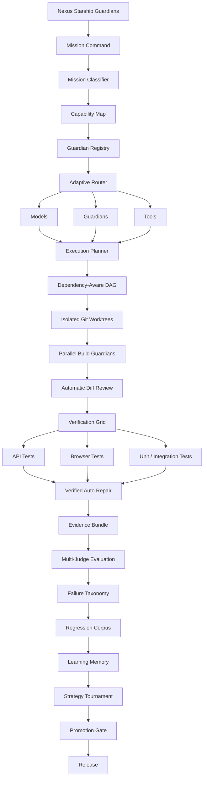
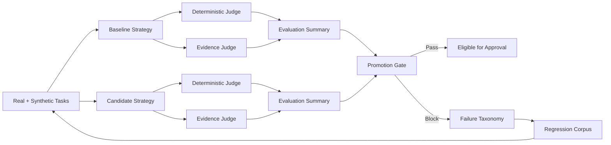
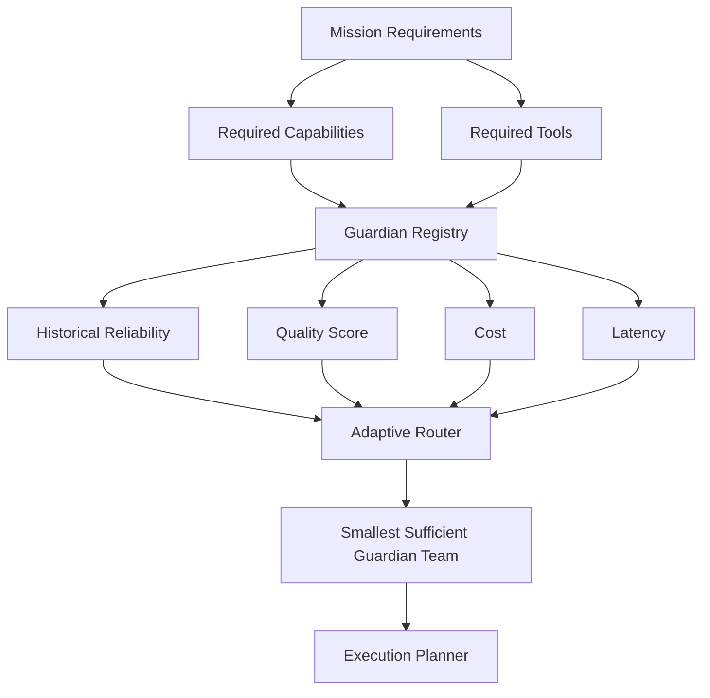
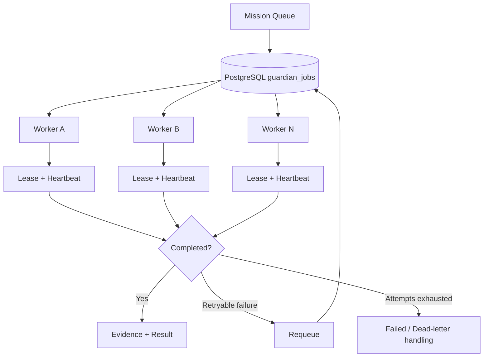

# Nexus Starship Guardians — Architecture Visuals

These Mermaid diagrams are the canonical GitHub-viewable visual architecture for Nexus Starship Guardians. Update them whenever a meaningful execution, learning, routing, or deployment change is made.

## End-to-end architecture



## Guardian Intelligence loop



## Adaptive Guardian routing



## Distributed execution



## Repository update standard

Every meaningful change should leave four forms of evidence in GitHub:

```text
Code + Tests + Documentation/Visuals + Learnings/Retrospective
```

This makes architecture drift and undocumented self-learning less likely.
