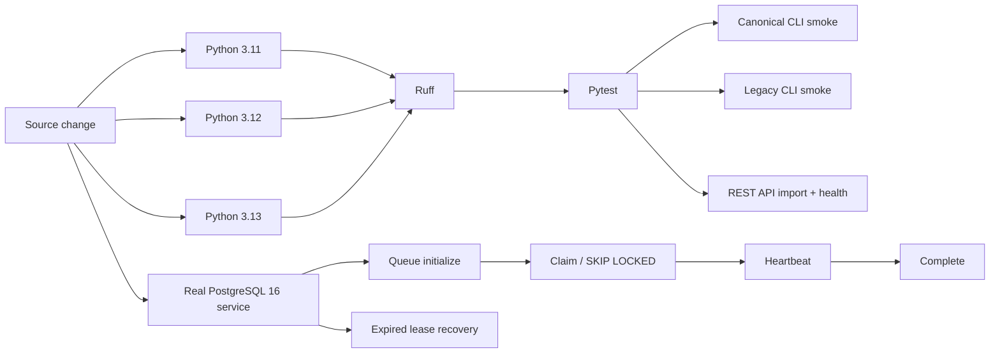

# Nexus Starship Guardians — Compatibility and Production Verification

This document defines the compatibility contract used while Nexus Starship Guardians evolves from its earlier runtime names.

## Compatibility rule

New product-facing usage should use **Nexus Starship Guardians** and the canonical CLI `nexus-guardians`.

The following technical compatibility surfaces remain supported intentionally so existing integrations do not break during the migration:

- Python import namespace: `nexus_os`
- Legacy CLI alias: `nexus-portable`
- Existing REST v1 wire fields such as `agent` / `agents`
- Existing `NEXUS_*` environment-variable prefix

These names are compatibility interfaces, not the current product name. Removing them requires an explicit major-version migration plan, deprecation window, and regression suite.

## Verification matrix

## Required guarantees

1. `pip install -e '.[dev]'` succeeds on every supported Python version.
2. `import nexus_os` remains valid while the compatibility namespace is supported.
3. `nexus-guardians doctor` is the canonical CLI smoke test.
4. `nexus-portable doctor` continues to work as a legacy alias.
5. The FastAPI application imports in a clean Python process and reports `Nexus Starship Guardians` as its title.
6. The `/health` endpoint returns an OK status before release.
7. PostgreSQL queue claims are exercised against a real PostgreSQL service in CI, not only string/unit tests.
8. CI failures block merge until corrected.

## Rename safety

Do **not** mechanically rename internal identifiers simply because they contain an older technical word. A rename is safe only when one of these is true:

- no external caller can observe the identifier; or
- a compatibility alias exists and is tested; or
- a versioned migration path is documented and validated.

This prevents branding cleanup from breaking Lucio AI Platform, Ember, Nexus Code, scripts, SDKs, or existing deployments.

## Current production-hardening boundary

The compatibility and CI matrix verifies package installation, imports, CLI entry points, API health, unit tests, and real PostgreSQL queue behavior. It does not by itself prove every external provider, browser, Railway deployment, Supabase project, or third-party MCP service is available; those require integration-specific credentials/environments and should be tested in dedicated gated workflows.
