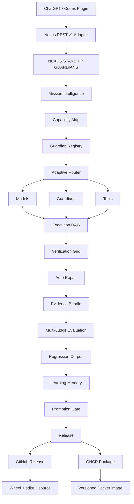

# Nexus Starship Guardians — Current State

> **Repository standard:** this graph must be updated in the same pull request whenever a meaningful architecture, execution, evaluation, learning, integration, release, or packaging change modifies the system flow.

## Current State Graph

## System state

- **Mission Intelligence:** deterministic classification, explicit capability requirements, bounded team sizing.
- **Capability Map:** maps mission language to capabilities and required tools without granting permissions.
- **Guardian Registry:** capability, tool-access, quality, reliability, cost, latency, and persistent cross-project evidence.
- **Adaptive Router:** selects bounded Guardian teams from explicit requirements and permission-safe candidates.
- **Execution DAG:** dependency-aware execution with isolated worktrees, structured file operations, durable queues, and bounded concurrency.
- **Verification Grid:** Python compatibility matrix, Ruff, pytest, live Uvicorn HTTP, Docker health, PostgreSQL integration, provider contracts, browser/API/unit checks.
- **Auto Repair:** bounded build → verify → repair → reverify loops.
- **Evidence Bundle:** SHA-256 provenance and verification evidence.
- **Multi-Judge Evaluation:** deterministic, evidence, Guardian, and alternate-model judge support.
- **Regression Corpus:** verified failures can become deduplicated persistent regression cases.
- **Learning Memory:** episodic memory, reflection, lesson retrieval, and cross-project performance evidence; no live model-weight mutation.
- **Promotion Gate:** blocks critical regressions, score/pass-rate regression, and optional cost/latency overruns.
- **ChatGPT/Codex Plugin:** reconciled `nexus-starship-guardians` v0.3 package with current Guardian terminology and REST v1 compatibility.
- **Nexus REST v1 Adapter:** legacy `agent` / `agents` wire fields retained only as compatibility contracts.
- **Release outputs:** GitHub Releases carry versioned source and Python build artifacts; GitHub Packages uses GHCR for versioned Docker images.

## Maintenance rule

The Current State Graph is not marketing-only artwork. It is architecture documentation. If a pull request adds, removes, renames, bypasses, or materially changes one of these stages, update both this file and `docs/assets/current-state-graph.svg` before merge.
