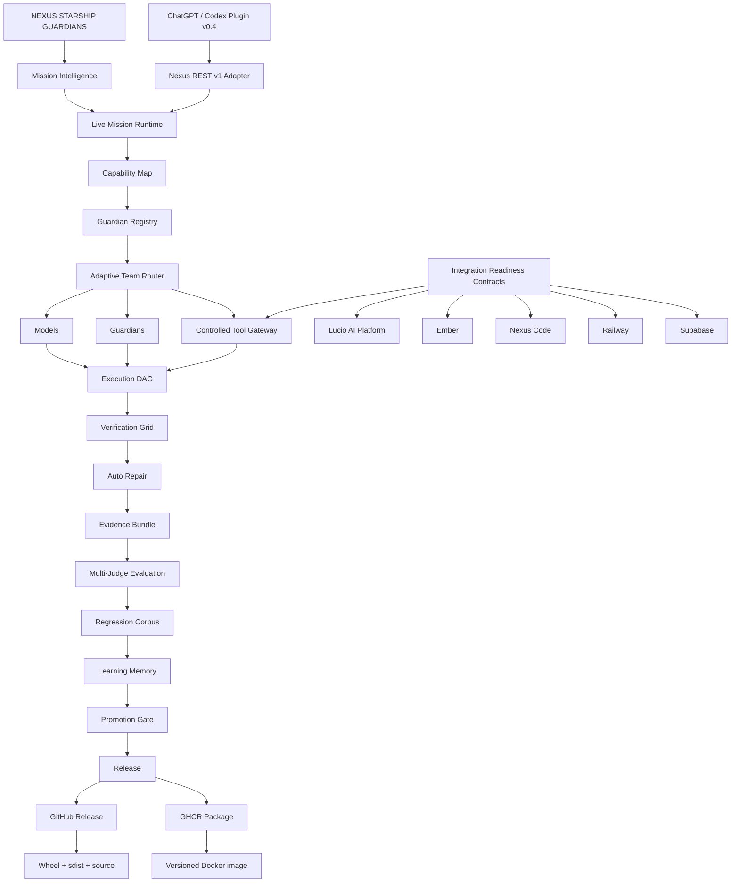

# Nexus Starship Guardians — Current State

> **Repository standard:** this graph must be updated in the same pull request whenever a meaningful architecture, execution, evaluation, learning, integration, release, or packaging change modifies the system flow.

## Current State Graph

## System state

- **Mission Intelligence:** deterministic intent classification, confidence/reasons, explicit capability requirements, and bounded team sizing.
- **Live Mission Runtime:** runs mission classification before normal REST v1 execution and records one `mission_intelligence` event in the durable run trace. The plan is advisory for legacy v1 execution so existing clients are not broken.
- **Capability Map:** maps mission language to capabilities and high-level required tools without granting permissions.
- **Guardian Registry:** capability, tool-access, quality, reliability, cost, latency, and persistent cross-project evidence.
- **Adaptive Team Router:** can assemble multiple Guardians whose combined capabilities and explicit tool allowlists satisfy a mission; no single Guardian must possess every required capability.
- **Controlled Tool Gateway:** separates high-level external-tool policy from local runtime tools. A required tool is allowed only when the project enables it and a selected Guardian is explicitly permitted to use it. This policy layer does not itself provide MCP, browser, Railway, Supabase, database, shell, or model connectivity.
- **Integration Readiness Contracts:** Lucio AI Platform, Ember, Nexus Code, Railway, and Supabase contracts report required capabilities/tools and gaps while keeping `connected=false` unless a real authenticated adapter proves otherwise.
- **Execution DAG:** dependency-aware execution with isolated worktrees, structured file operations, durable queues, and bounded concurrency.
- **Verification Grid:** Python compatibility matrix, Ruff, pytest, live Uvicorn HTTP, Docker health, PostgreSQL integration, release-artifact build, provider contracts, browser/API/unit checks.
- **Auto Repair:** bounded build → verify → repair → reverify loops.
- **Evidence Bundle:** SHA-256 provenance and verification evidence.
- **Multi-Judge Evaluation:** deterministic, evidence, Guardian, and alternate-model judge support.
- **Regression Corpus:** verified failures can become deduplicated persistent regression cases.
- **Learning Memory:** episodic memory, reflection, lesson retrieval, and cross-project performance evidence; no live model-weight mutation.
- **Promotion Gate:** blocks critical regressions, score/pass-rate regression, and optional cost/latency overruns.
- **ChatGPT/Codex Plugin:** `nexus-starship-guardians` v0.4 aligns with live mission-planning and integration-readiness contracts while retaining REST v1 compatibility.
- **Nexus REST v1 Adapter:** legacy `agent` / `agents` wire fields remain compatibility contracts; product-facing terminology is Guardian/Guardians.
- **Release outputs:** GitHub Releases carry semantic release notes, source, wheel, and sdist; GitHub Packages publishes versioned GHCR Docker images.

## Maintenance rule

The Current State Graph is not marketing-only artwork. It is architecture documentation. If a pull request adds, removes, renames, bypasses, or materially changes one of these stages, update both this file and `docs/assets/current-state-graph.svg` before merge.
