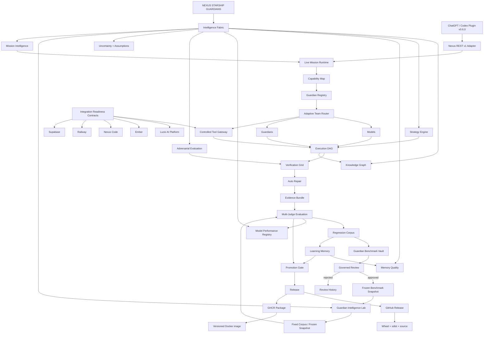

# Nexus Starship Guardians — Current State

> **Repository standard:** this graph must be updated in the same pull request whenever a meaningful architecture, intelligence, execution, evaluation, learning, integration, release, or packaging change modifies the system flow.


## Current State Graph



## System state

- **Intelligence Fabric:** combines deterministic mission interpretation, strategy selection, adversarial guardrails, uncertainty/assumptions, Knowledge Graph context, memory-quality evidence, model-performance evidence, and controlled evaluation into an inspectable planning layer.
- **Knowledge Graph:** stores explicit project/system nodes and directed relationships and supports dependency/impact traversal. Relationships must come from verified or explicit inputs rather than model invention.
- **Strategy Engine:** selects inspectable strategies such as research-first, prototype-first, test-first, security-first, migration-safe, cost-optimized, or balanced, with rationale and required evidence.
- **Memory Quality:** tracks whether reused lessons were helpful, harmful, or neutral and can quarantine repeatedly harmful memory so self-learning does not reinforce bad guidance.
- **Model Performance Registry:** records verified model success, score, cost, and latency by task category. It supports evidence-driven ranking without granting provider credentials or access.
- **Adversarial Evaluation:** creates deterministic guardrail cases for unsupported deployment claims, unsafe schema change, permission escalation, fabricated integrations, and unsupported completion claims.
- **Uncertainty + Assumptions:** exposes interpretation uncertainty and assumptions instead of hiding ambiguity behind confident prose.
- **Guardian Intelligence Lab:** runs baseline/candidate evaluation against versioned fixed corpora, binds runs to corpus ID/version/SHA-256, and rejects comparisons when the evaluated corpus differs.
- **Fixed Corpus / Frozen Snapshot:** repository-owned benchmark manifests provide reproducible evaluation inputs. Core v1 remains immutable; reviewed Benchmark Vault cases enter new versioned snapshots instead of rewriting the core in place.
- **Guardian Benchmark Vault:** receives verified regression cases as evidence-linked candidates, deduplicates nominations, stores review status, and creates new `FixedEvaluationCorpus` snapshots only from approved cases.
- **Governed Review:** candidates remain outside permanent benchmark truth until explicitly approved. Rejected candidates remain audit history and are excluded from snapshots.
- **Mission Intelligence:** deterministic intent classification, confidence/reasons, explicit capability requirements, and bounded team sizing.
- **Live Mission Runtime:** records both `mission_intelligence` and `strategy_intelligence` before normal REST v1 provider/tool execution. Intelligence plans remain advisory to preserve compatibility unless a future governed policy explicitly makes a gate blocking.
- **Capability Map:** maps mission language to capabilities and high-level required tools without granting permissions.
- **Guardian Registry:** capability, tool-access, quality, reliability, cost, latency, and persistent cross-project evidence.
- **Adaptive Team Router:** can assemble multiple Guardians whose combined capabilities and explicit tool allowlists satisfy a mission.
- **Controlled Tool Gateway:** separates high-level external-tool policy from local runtime tools. A requirement never grants access by itself.
- **Integration Readiness Contracts:** Lucio AI Platform, Ember, Nexus Code, Railway, and Supabase contracts report capabilities/tools/gaps while keeping `connected=false` until a real authenticated adapter proves otherwise.
- **Execution DAG:** dependency-aware execution with isolated worktrees, structured file operations, durable queues, and bounded concurrency.
- **Verification Grid:** Python compatibility matrix, Ruff, pytest, live Uvicorn HTTP, Docker health, PostgreSQL integration, release-artifact build, provider contracts, browser/API/unit checks.
- **Auto Repair:** bounded build → verify → repair → reverify loops.
- **Evidence Bundle:** SHA-256 provenance and verification evidence.
- **Multi-Judge Evaluation:** deterministic, evidence, Guardian, and alternate-model judge support. Fixed-corpus runs feed the same evidence layer.
- **Regression Corpus:** verified failures become deduplicated persistent regression cases. When the Benchmark Vault is enabled, those verified cases can be nominated automatically with an evidence reference.
- **Learning Memory:** episodic memory, reflection, lesson retrieval, and cross-project performance evidence; no live model-weight mutation.
- **Promotion Gate:** blocks corpus mismatch, critical regressions, score/pass-rate regression, and optional cost/latency overruns.
- **ChatGPT/Codex Plugin:** `nexus-starship-guardians` v0.6.0 documents the Benchmark Vault, Intelligence Lab, and existing REST v1 compatibility surfaces.
- **Nexus REST v1 Adapter:** legacy `agent` / `agents` wire fields remain compatibility contracts; product-facing terminology is Guardian/Guardians.
- **Release outputs:** GitHub Releases carry semantic release notes, source, wheel, and sdist; GitHub Packages publishes versioned GHCR Docker images.

## Benchmark learning invariant

```text
verified failure
    ↓
regression case
    ↓
benchmark candidate
    ↓
review
  ↙     ↘
reject  approve
          ↓
 versioned snapshot
          ↓
 Intelligence Lab
```

Automatic learning is allowed to propose benchmark knowledge. It is not allowed to silently rewrite benchmark truth.

## Maintenance rule

The Current State Graph is not marketing-only artwork. It is architecture documentation. If a pull request adds, removes, renames, bypasses, or materially changes one of these stages, update both this file and `docs/assets/current-state-graph.svg` before merge.
