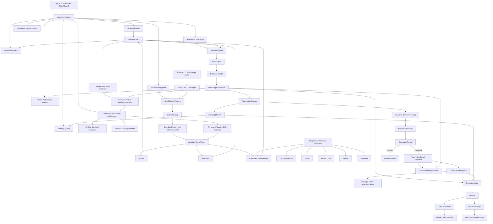

# Nexus Starship Guardians — Current State

> **Repository standard:** this graph must be updated in the same pull request whenever a meaningful architecture, intelligence, execution, evaluation, learning, integration, release, or packaging change modifies the system flow.


## Current State Graph



## System state

- **Live Adaptive Guardian Intelligence:** persistent specialist intelligence is instantiated by the API runtime and supplied to the live Mission Runtime and Adaptive Team Router. The state path defaults to `./data/adaptive_guardian_intelligence.json` and is configurable with `NEXUS_ADAPTIVE_INTELLIGENCE_PATH`.
- **10 Elite Specialist Guardians:** AI Architect, Software Platform Engineer, AI Developer, Coder Specialist, AI Engineer, Debugger Specialist, AI Scientist, AI Cloud Specialist, API Specialist, and AI Programmer Guardians are now registered in the default live Guardian Registry rather than existing only as profile definitions.
- **Automatic Verified Specialist Learning:** terminal specialist runs feed adaptive skill evidence automatically only when verification is objective. Successful runs require a `test`, `api`, `browser`, or `security` tool result; concrete provider/policy/tool/max-step failures can teach failure evidence. A self-reported final answer does not reinforce expertise.
- **Adaptive skill evidence:** tracks per-skill success rate, quality, benchmark performance, recent trend, confidence, and critical-regression penalties. It produces bounded routing bonuses and targeted training priorities without changing permissions or model weights.
- **Training Priorities:** weak, uncertain, declining, or regression-prone skills are surfaced automatically for replay and additional evaluation instead of being hidden in one aggregate score.
- **Adaptive Team Router:** live routing receives the persistent adaptive intelligence engine and can use a bounded evidence bonus for repeatedly verified specialist strengths. Performance never grants tool access.
- **Dynamic API versioning:** FastAPI metadata and `/health` now report the package `__version__` instead of a stale hard-coded version. Health also exposes `adaptive_guardian_intelligence=live` and the live specialist count.
- **Benchmark Replay:** replays pending Benchmark Vault candidates against selected strategies before review and records replay passes/failures, score, strategy, and failure category back into the vault.
- **Coverage Intelligence:** measures benchmark breadth across architecture, platform, coding, debugging, AI/ML, evaluation, cloud, API, security, database, UI, deployment, tool-use, and reliability. It identifies gaps and snapshot-to-snapshot growth.
- **Guardian Benchmark Vault:** verified regressions become evidence-linked candidates. Replay can strengthen review evidence, but replay never auto-approves benchmark truth.
- **Guardian Intelligence Lab:** compares baseline/candidate strategies on identical fingerprinted corpora and rejects mismatched corpus identity.
- **Learning Memory + Memory Quality:** reusable lessons remain evidence-scored and harmful memory can be quarantined.
- **Model Performance Registry:** model selection remains based on verified task-specific evidence rather than hard-coded claims.
- **Controlled Tool Gateway:** capabilities, learning, routing scores, and benchmark performance never grant permissions or credentials.
- **Execution + Verification:** isolated execution, verification, repair, evidence bundles, multi-judge evaluation, regression capture, and promotion gates remain the evidence backbone for all automatic learning.
- **Release outputs:** GitHub Releases publish source/wheel/sdist and GHCR publishes versioned Docker images.

## Automatic specialist-learning loop

```text
mission
  ↓
live specialist Guardian selection
  ↓
execution
  ↓
objective verification OR concrete failure evidence
  ↓
automatic per-skill outcome update
  ↓
confidence / trend / regression analysis
  ↓
training priorities + bounded routing adaptation
  ↓
next mission uses stronger evidence
```

Successful runs without objective verification do **not** update adaptive specialist evidence.

## Benchmark replay + coverage loop

```text
verified failure
    ↓
regression case
    ↓
benchmark candidate
    ↓
automatic replay
    ↓
replay evidence
    ↓
governed review
  ↙         ↘
reject     approve
             ↓
     versioned snapshot
             ↓
      coverage analysis
             ↓
 specialist training gaps
```

Automatic learning may adapt memory, skill evidence, training priorities, and routing preference from verified evidence. It may **not** silently mutate model weights, grant permissions, or approve benchmark truth.

## Maintenance rule

The Current State Graph is architecture documentation. If a pull request adds, removes, renames, bypasses, or materially changes one of these stages, update both this file and `docs/assets/current-state-graph.svg` before merge.
