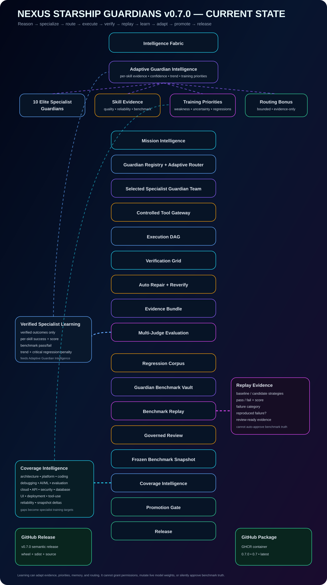
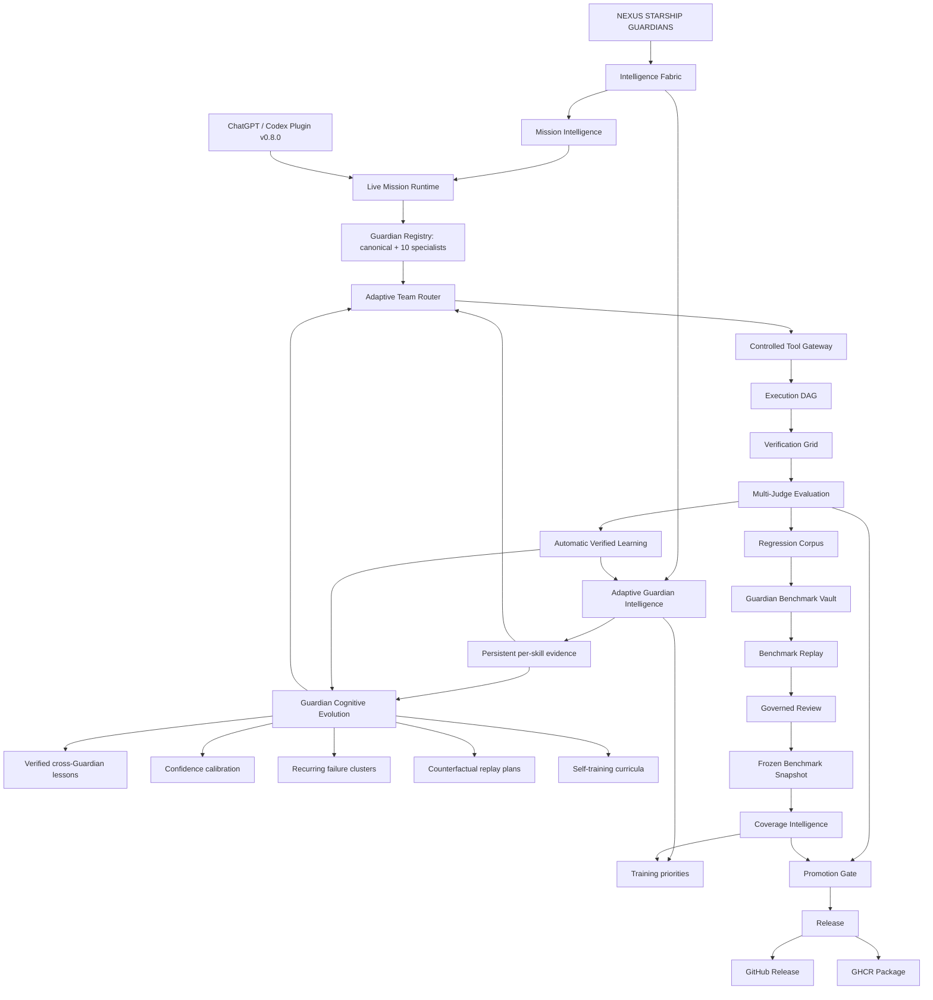

# Nexus Starship Guardians — Current State · v0.8.0

> **Repository standard:** this graph must be updated in the same pull request whenever a meaningful architecture, intelligence, execution, evaluation, learning, integration, release, or packaging change modifies the system flow.



## Current State Graph



## System state

- **Guardian Cognitive Evolution:** persistent meta-learning layer above direct adaptive competence. It stores verified lessons, confidence calibration, recurring failure clusters, counterfactual replay cycles, and personalized self-curricula.
- **Verified cross-Guardian learning:** relevant peer lessons can inform another specialist, but the recipient never inherits the source Guardian's competence score, success rate, benchmark rate, confidence, permissions, or authorization.
- **Confidence calibration:** predicted mission confidence is compared with verified outcomes. Overconfidence can reduce the small cognitive routing contribution.
- **Failure intelligence:** recurring verified failures are grouped by signature across Guardians and skills instead of being treated as isolated incidents.
- **Automatic counterfactual replay:** verified failures trigger alternate-strategy generation such as minimal reproduction, hypothesis-first debugging, contract-first validation, adversarial testing, rollback simulation, or tradeoff review depending on domain.
- **Self-curriculum:** adaptive weaknesses, low confidence, negative trends, regressions, recurring failure clusters, and relevant peer lessons combine into practice priorities and evidence-backed exercises.
- **Bounded cognitive routing:** routing combines registry utility, direct adaptive skill evidence, and a deliberately smaller cognitive/calibration contribution. Performance still never grants tool access.
- **Live Adaptive Guardian Intelligence:** persistent specialist skill state is instantiated by the API runtime and supplied to live routing.
- **10 Elite Specialist Guardians:** AI Architect, Software Platform Engineer, AI Developer, Coder Specialist, AI Engineer, Debugger Specialist, AI Scientist, AI Cloud Specialist, API Specialist, and AI Programmer Guardians remain registered in the live default registry.
- **Automatic verified learning:** successful runs require objective `test`, `api`, `browser`, or `security` evidence before reinforcing expertise; concrete runtime failures can teach failure evidence automatically.
- **Live cognitive inspection:** `/v1/projects/{project_id}/guardians/{guardian_id}/cognitive-summary` exposes adaptive evidence plus cognitive episodes, authored lessons, calibration, counterfactual-cycle count, and current curriculum.
- **Separate persistence:** direct adaptive competence defaults to `./data/adaptive_guardian_intelligence.json`; cognitive state defaults to `./data/guardian_cognitive_evolution.json`.
- **Benchmark Replay + Coverage Intelligence:** governed replay and benchmark breadth continue to feed specialist priorities without auto-approving benchmark truth.
- **Controlled Tool Gateway:** capabilities, learning, routing scores, benchmarks, lessons, and curricula never grant credentials or permissions.
- **Release outputs:** GitHub Releases publish source/wheel/sdist and GHCR publishes versioned Docker images.

## Cognitive evolution loop

```text
mission
  ↓
live specialist selection
  ↓
execution
  ↓
objective verification / concrete failure evidence
  ↓
per-skill adaptive update
  ↓
verified cognitive episode
  ├─ reusable lesson
  ├─ confidence calibration
  ├─ failure cluster
  ├─ counterfactual strategies
  └─ self-curriculum
  ↓
bounded routing adaptation
  ↓
next mission
```

## Governance invariant

Automatic intelligence may adapt memory, per-skill evidence, verified lessons, calibration, failure intelligence, replay strategies, curricula, and bounded routing preference. It may **not** silently mutate hosted model weights, grant permissions, clone another Guardian's competence score, approve benchmark truth, overwrite frozen corpora, or bypass promotion/release gates.

## Maintenance rule

The Current State Graph is architecture documentation. If a pull request adds, removes, renames, bypasses, or materially changes one of these stages, update both this file and `docs/assets/current-state-graph.svg` before merge.
