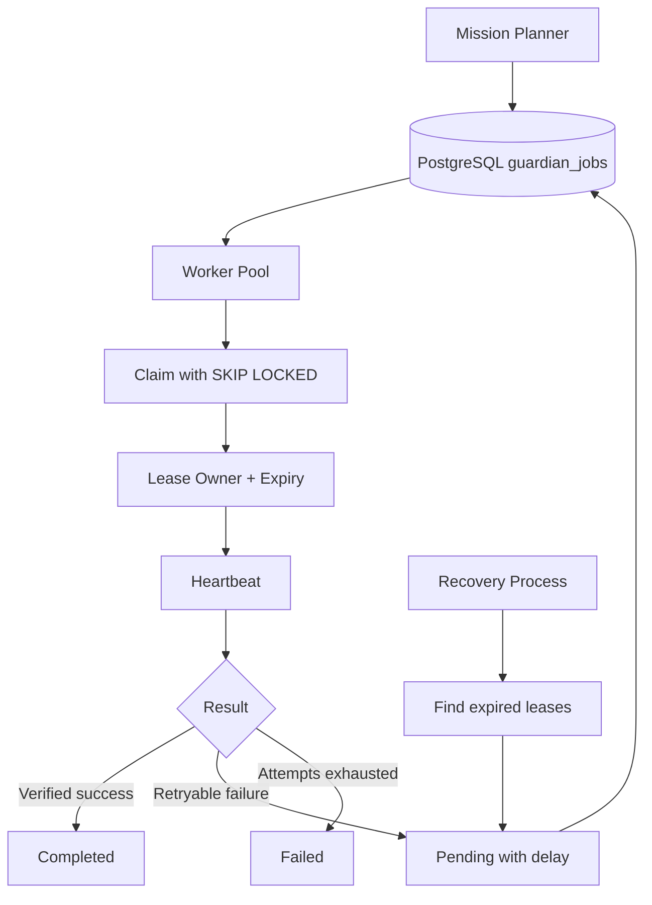

# Distributed Execution

The next-scale execution layer moves beyond one-process SQLite coordination toward PostgreSQL-backed leases that multiple Guardian workers can claim safely.

## Implemented foundation

`nexus_os.distributed_queue.PostgresGuardianQueue` provides:

- PostgreSQL table/index DDL;
- FIFO pending-job claims;
- `FOR UPDATE SKIP LOCKED` worker coordination;
- bounded attempts;
- worker leases;
- heartbeat renewal;
- retry scheduling;
- completion/failure transitions;
- expired-lease recovery.

The adapter accepts an injected DB-API style connection factory, so the core package does not force one PostgreSQL driver. A production deployment can use psycopg or another compatible driver through that boundary.

## Architecture

## Production work still required

The SQL/adapter semantics are implemented and unit tested, but CI does not currently launch a live PostgreSQL service. Before calling this production-verified, add an integration workflow with PostgreSQL that validates concurrent claims, lease expiry, worker crashes, transaction isolation, and schema migrations.

## Recommended next infrastructure

- PostgreSQL managed instance;
- explicit schema migrations;
- worker identity and heartbeat metrics;
- dead-letter review workflow;
- OpenTelemetry tracing;
- per-project concurrency/budget limits;
- queue-depth and lease-expiry alerts.
