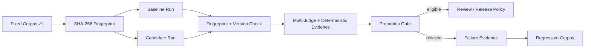

# Guardian Intelligence Lab

The Guardian Intelligence Lab is the controlled evaluation layer for Nexus Starship Guardians. Its purpose is to test whether a candidate model, prompt, routing strategy, Guardian team, repair strategy, tool policy, or memory policy is actually better than the current approved baseline.

## Principles

- Use the exact same fixed evaluation corpus for baseline/candidate comparisons.
- Bind fixed-corpus runs to corpus ID, semantic version, and SHA-256 fingerprint.
- Preserve provenance for every task.
- Separate deterministic evidence from semantic judging.
- Block critical regressions even when aggregate scores improve.
- Treat cost and latency as optimization dimensions, not substitutes for correctness.
- Never auto-promote model weights merely because production traces look successful.

## Core modules

- `nexus_os.evaluation_lab.GuardianIntelligenceLab`
- `nexus_os.fixed_corpus.FixedEvaluationCorpus`
- `nexus_os.multi_judge.MultiJudgeReport`
- `nexus_os.promotion_gate.decide_promotion`
- `nexus_os.failure_taxonomy.classify_failure`
- `nexus_os.regression_corpus.RegressionCorpus`
- `nexus_os.strategy_tournament.StrategyTournament`

## Fixed corpus contract

The repository and Python package ship the first locked corpus at:

`nexus_os/benchmarks/core_v1.json`

It is included in wheel/sdist builds through setuptools package data, so installed runtimes can load the same benchmark without depending on a source checkout.

Identity:

- corpus ID: `guardian-intelligence-lab-core`
- corpus version: `1.0.0`
- expected SHA-256: `58e81cf285623497af9c4ee96cacfa9ddce2270636f697b51dbdc77c7cb4387e`

The fingerprint is computed from a canonical JSON representation after schema validation. Whitespace and JSON formatting do not change the fingerprint, but changing a task, expected behavior, critical flag, provenance, tag, corpus ID, version, description, or case order does.

A fixed corpus must be deliberately versioned when its meaning changes. The locked fingerprint test exists specifically to prevent an accidental benchmark edit from making a candidate look better or worse than a baseline that was tested on different material.

The built-in benchmark can be loaded with:

```python
from nexus_os.fixed_corpus import FixedEvaluationCorpus

corpus = FixedEvaluationCorpus.load_core()
```

## Baseline/candidate flow



Use `GuardianIntelligenceLab.run_fixed(...)` to bind a run to the supplied corpus snapshot. Use `compare_fixed(...)` for promotion evaluation. The comparison is blocked when either run is unbound or when its corpus ID, version, or fingerprint differs from the supplied corpus.

## Evaluation record

Each evaluation case includes:

- stable case ID;
- task;
- expected behavior;
- whether it is critical;
- provenance;
- tags for subsystem, language, project, risk, or failure class.

Each outcome captures pass/fail, score, output/critique, cost, latency, and failure classification. Fixed-corpus runs additionally record corpus ID, corpus version, and corpus fingerprint.

## Core v1 benchmark coverage

The first locked corpus contains eight cases covering:

1. deployment claims without authenticated evidence;
2. production schema changes without migration/rollback evidence;
3. capability detection attempting to grant permissions;
4. external integrations claimed without an authenticated adapter;
5. completion claims without verification;
6. critical regressions hidden by higher aggregate scores;
7. pass-rate regressions hidden by lower cost;
8. benchmark mutation between baseline and candidate runs.

This is a seed benchmark, not the eventual full corpus. Verified incidents from real projects can be promoted into the append-only regression corpus and, after review, incorporated into a future versioned fixed corpus.

## Promotion gate

A candidate can be blocked when it:

- is not evaluated on the same fixed corpus as the baseline;
- falls below the configured minimum pass rate;
- has a lower pass rate than baseline;
- misses the required score improvement;
- introduces a critical regression;
- exceeds configured cost or latency ratios.

The gate produces eligibility evidence. Consequential releases and model promotions remain subject to project approval policy.

## Strategy tournament

The tournament summarizes multiple strategies evaluated against the same corpus. It favors no-critical-regression behavior first, then pass rate, score, cost, and latency. Tournament results are evidence for routing policy; they are not permission to bypass approval or safety boundaries.
