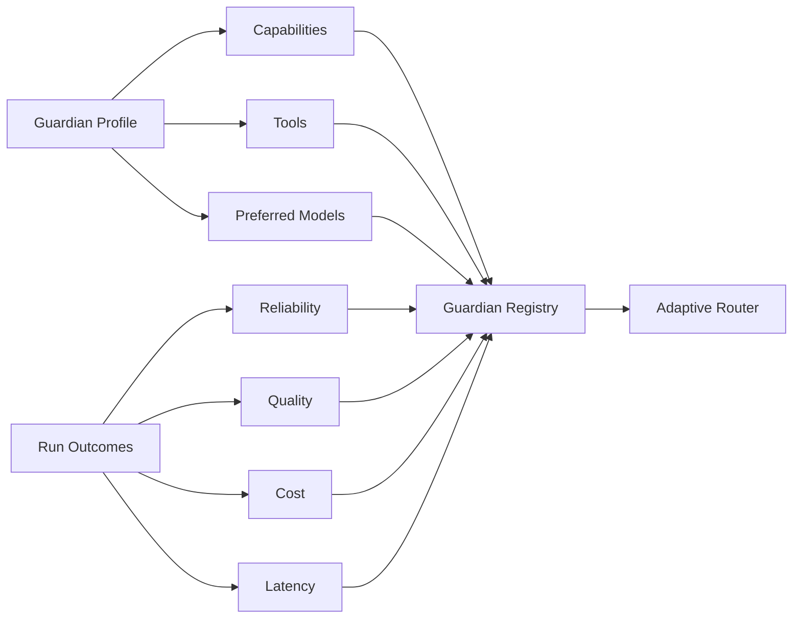

# Guardian Capability Registry

The Guardian Registry stores what each Guardian can do and the evidence accumulated from previous work.

## Profile data

Each `GuardianProfile` includes:

- Guardian ID;
- role;
- capabilities;
- allowed tools;
- preferred models.

Each registered Guardian also accumulates metrics:

- attempts;
- successful missions;
- success rate;
- average evaluation score;
- average cost;
- average latency.

## Selection model

`GuardianRegistry.select()` first filters by required capabilities and tools, then orders candidates by a utility function derived from quality, reliability, cost, and latency.

The initial utility function is intentionally simple and auditable. Future weighting changes should be evaluated in the Guardian Intelligence Lab before promotion.

## Safety rule

Historical performance does not grant new permissions. A high-performing Guardian still cannot use a tool that is not allowed by the project/tool policy.
