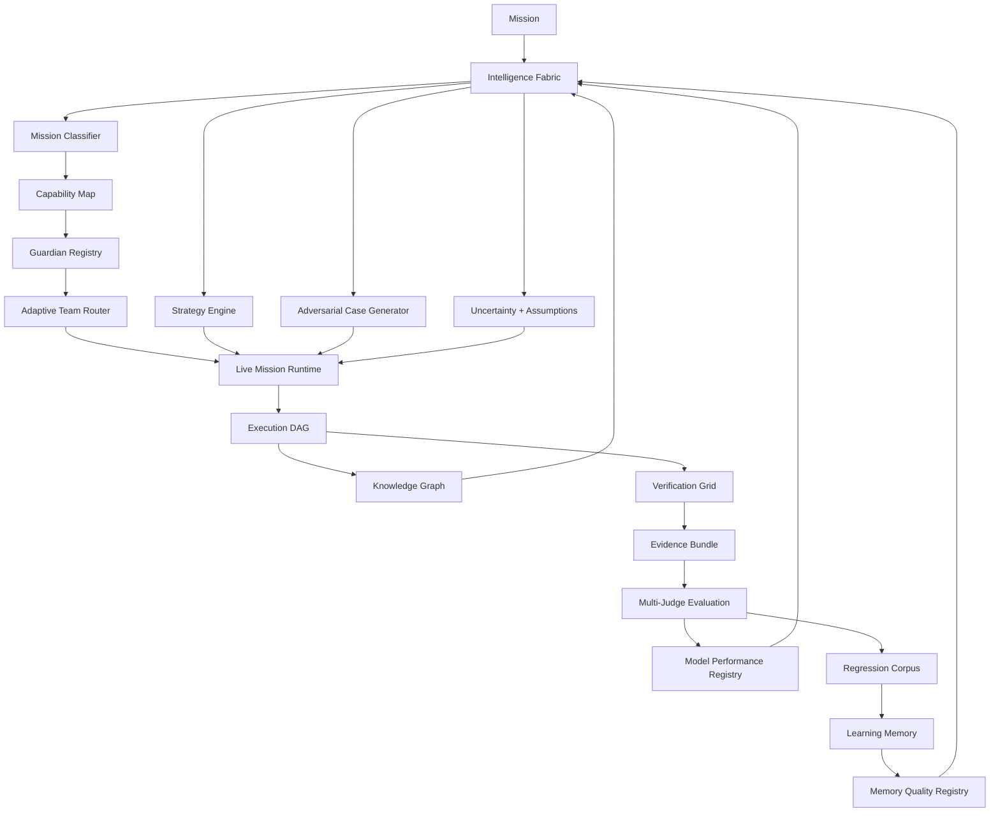

# Nexus Starship Guardians — Intelligence Fabric

The **Intelligence Fabric** is the v0.5 decision layer that sits above the live Mission Runtime. It improves how Nexus decides **what strategy to use, what evidence to demand, what risks to test, what prior knowledge may matter, and which models should be preferred from measured history**.

## Current intelligence flow



## Intelligence components

### Knowledge Graph

`KnowledgeGraph` stores explicit nodes and relationships for modules, services, APIs, tests, databases, projects, Guardians, and other project/system entities. Its first capability is dependency/impact traversal so a change can answer questions such as:

- what depends on this module;
- what tests cover this API;
- what downstream components may be affected;
- what project owns this node.

The graph is deterministic and inspectable. It does not invent relationships that have not been added from repository analysis or verified evidence.

### Strategy Engine

`StrategyEngine` converts Mission Classification evidence into an explicit execution strategy:

- `research_first`
- `prototype_first`
- `test_first`
- `security_first`
- `migration_safe`
- `cost_optimized`
- `balanced`

The strategy includes its rationale, evidence requirements, repair-round limit, and escalation threshold. Strategy selection is inspectable and can later be benchmarked in the Guardian Intelligence Lab.

### Model Performance Registry

`ModelRegistry` records verified model performance by task category. It tracks success, score, cost, and latency instead of hard-coding claims that one model is universally better than another.

Model ranking is therefore evidence-driven and task-specific. A future router may use this registry to choose between configured model providers, but model ranking never grants credentials or external access.

### Memory Quality Registry

`MemoryQualityRegistry` tracks whether a lesson or memory was helpful, harmful, or neutral when reused. Repeatedly harmful memory can be quarantined so self-learning does not become self-reinforcing error.

This is deliberately separate from raw memory storage: **remembering something and trusting it are different decisions**.

### Adversarial Evaluation

`AdversarialCaseGenerator` creates deterministic guardrail cases from the mission risk surface. Initial cases cover:

- unsupported deployment claims;
- database/schema changes without rollback evidence;
- permission escalation from capability detection;
- fabricated external integrations;
- unsupported completion claims.

Generated adversarial cases are evaluation candidates, not automatic proof that a failure occurred.

### Uncertainty and assumptions

`IntelligenceFabric.plan()` exposes an explicit uncertainty value and assumptions. Low-confidence mission interpretation can therefore be surfaced before consequential execution rather than hidden behind confident prose.

## Live REST contract

The project-scoped endpoint:

```text
POST /v1/projects/{project_id}/intelligence-plan
```

returns:

- mission kind;
- confidence and uncertainty;
- capabilities and required tools;
- selected strategy and rationale;
- required evidence;
- adversarial guardrail cases;
- assumptions.

Every live run also records one durable `strategy_intelligence` event alongside the existing `mission_intelligence` event before normal provider/tool execution.

## Safety and compatibility boundaries

- Intelligence output proposes strategy and evidence requirements; it does not grant permissions.
- Model ranking does not create credentials or connect a provider.
- Knowledge Graph relationships must come from explicit/verified inputs.
- Memory quality can quarantine unreliable lessons but does not modify model weights.
- Adversarial cases are test proposals, not automatic failure declarations.
- REST v1 `agent` / `agents` fields remain compatibility contracts.
- Existing `nexus_os`, `NEXUS_*`, and `nexus-portable` compatibility surfaces remain supported.

## Next intelligence targets

After v0.5 is verified, the next intelligence milestones are:

1. repository ingestion into the Knowledge Graph;
2. persistent Knowledge Graph storage and project/tenant scoping;
3. persistent Model Registry metrics;
4. retrieval quality scoring and automatic memory supersession;
5. strategy tournament benchmarking before automatic strategy promotion;
6. hypothesis-driven debugging and causal failure graphs;
7. context compression/relevance scoring;
8. governed model-router integration using verified historical performance.
