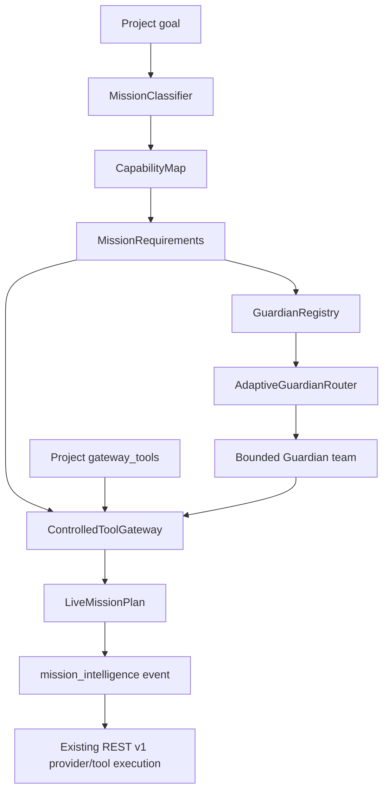

# Nexus Starship Guardians — Live Mission Runtime

Nexus Starship Guardians v0.4 moves Mission Intelligence into the live project-scoped REST path while preserving the existing REST v1 execution contract.

## Runtime flow



## Mission planning endpoint

`POST /v1/projects/{project_id}/mission-plan`

Request:

```json
{
  "goal": "Build a React API with tests"
}
```

The response includes:

- mission kind;
- classifier confidence;
- required capabilities;
- required high-level tools;
- selected Guardians;
- missing capabilities;
- missing Guardian tool coverage;
- project-disabled/blocked tools;
- overall planning sufficiency;
- deterministic reasons for the classification.

The endpoint is protected by the same project-scoped authentication as the rest of REST v1.

## Live run trace

Every new REST v1 run records a single `mission_intelligence` event before provider execution. That event preserves the mission plan in the durable run evidence stream.

For compatibility, an insufficient mission plan does **not** automatically reject an existing REST v1 run. The current v1 provider/tool path remains operational while Mission Intelligence is added as advisory evidence. A future version may introduce a deliberately versioned strict-execution mode.

## Controlled Tool Gateway

`gateway_tools` is separate from the existing local `allowed_tools` field.

- `allowed_tools` continues to control the current local REST v1 tools (`calculator`, `utc_now`, `project_note`).
- `gateway_tools` describes high-level external capabilities used for mission planning (`browser`, `api`, `database`, `test`, `security`, `terminal`, `observability`, `model`, `integration`).

A mission requiring a tool does not grant that tool. The policy requires both project enablement and explicit Guardian permission. The gateway is a policy boundary, not an external connection implementation.

## Collective Guardian routing

Adaptive routing no longer requires one Guardian to possess every capability/tool needed by a mission. The router greedily builds a bounded team whose **combined** capabilities and explicit tool allowlists cover the requirements, using historical utility only to rank contributors.

Historical performance never creates a permission.

## Integration readiness contracts

The runtime includes explicit readiness contracts for:

- `lucio`;
- `ember`;
- `nexus-code`;
- `railway`;
- `supabase`.

Readiness endpoint:

`GET /v1/projects/{project_id}/integrations/{integration_name}/readiness`

A readiness response reports required capabilities/tools and configuration gaps. `connected` remains `false` unless a future authenticated adapter supplies real connection evidence. A readiness result must never be presented as proof that Railway, Supabase, MCP, GitHub, a browser, or another external service is actually connected.

## Compatibility

The v0.4 runtime preserves:

- Python namespace `nexus_os`;
- `NEXUS_*` environment variables;
- `nexus-portable` legacy CLI alias;
- REST v1 `agent` / `agents` wire fields.

These are compatibility interfaces. User-facing product language remains Guardian/Guardians.

## Verification targets

The v0.4 test suite covers:

- collective team coverage across multiple Guardians;
- project vs Guardian tool permission boundaries;
- blocked high-level tools;
- project-scoped mission-plan API behavior;
- durable `mission_intelligence` run events;
- integration-readiness behavior and non-connection claims;
- existing REST v1 run/approval compatibility.
