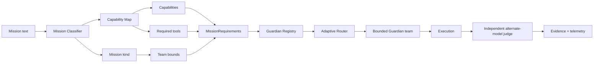

# Nexus Starship Guardians — Mission Intelligence

Mission Intelligence converts a user goal into explicit, inspectable requirements before Nexus selects Guardians, models, or tools.

## Flow

## Mission Classifier

`MissionClassifier` is deterministic by default. It classifies a mission as one of:

- bug fix;
- feature;
- refactor;
- test;
- deploy;
- research;
- general.

It also emits:

- explicit `MissionRequirements`;
- minimum and maximum Guardian team size;
- classification confidence;
- human-readable reasons explaining which rules matched.

The deterministic classifier deliberately avoids claiming semantic intelligence it does not have. A future model-assisted classifier may propose additional requirements, but deterministic policy remains the validation layer.

## Capability Map

`CapabilityMap` translates explicit mission language into capability and tool requirements. Current default domains include:

- frontend / browser;
- backend / API;
- database;
- testing;
- security;
- DevOps;
- observability;
- AI engineering;
- integrations;
- architecture.

When a mission does not match a specific domain, Nexus falls back to `general-engineering` rather than inventing specialized requirements.

## Permission boundary

Capability detection never grants permissions. The Capability Map may say a mission requires a browser or database, but the Adaptive Router may only select Guardians whose explicit `allowed_tools` satisfy those requirements.

## Alternate-model judging

`AlternateModelJudge` allows a provider independent from the builder to return a structured semantic judgment. Its response must be JSON containing:

- score from 0 to 10;
- pass/fail;
- rationale;
- critical-failure flag.

Malformed or incorrectly typed judge responses are rejected rather than coerced into a passing result. Deterministic and evidence judges remain the mandatory kinds in `MultiJudgeReport`; an alternate model is additional independent evidence, not a replacement for tests.

## Correlated telemetry

`guardian_span` creates a reusable correlation ID across nested Guardian operations. Current span metadata can include:

- correlation ID;
- Guardian ID;
- project ID;
- mission ID;
- operation name;
- success/failure.

This provides the context needed to connect API requests, queue work, Guardian actions, verification, and evidence in future observability backends.

## Cross-project performance

`CrossProjectPerformanceStore` records project-scoped Guardian outcomes and aggregates performance across projects while keeping the original project dimension. This allows future routing to learn from verified experience across Lucio AI Platform, Ember, Nexus Code, and other projects without erasing which project produced the evidence.

The store tracks:

- attempts and successes;
- average quality score;
- average cost;
- average latency;
- number of distinct projects represented.

Cross-project history is evidence for routing; it does not override project-specific tool permissions or tenant boundaries.
