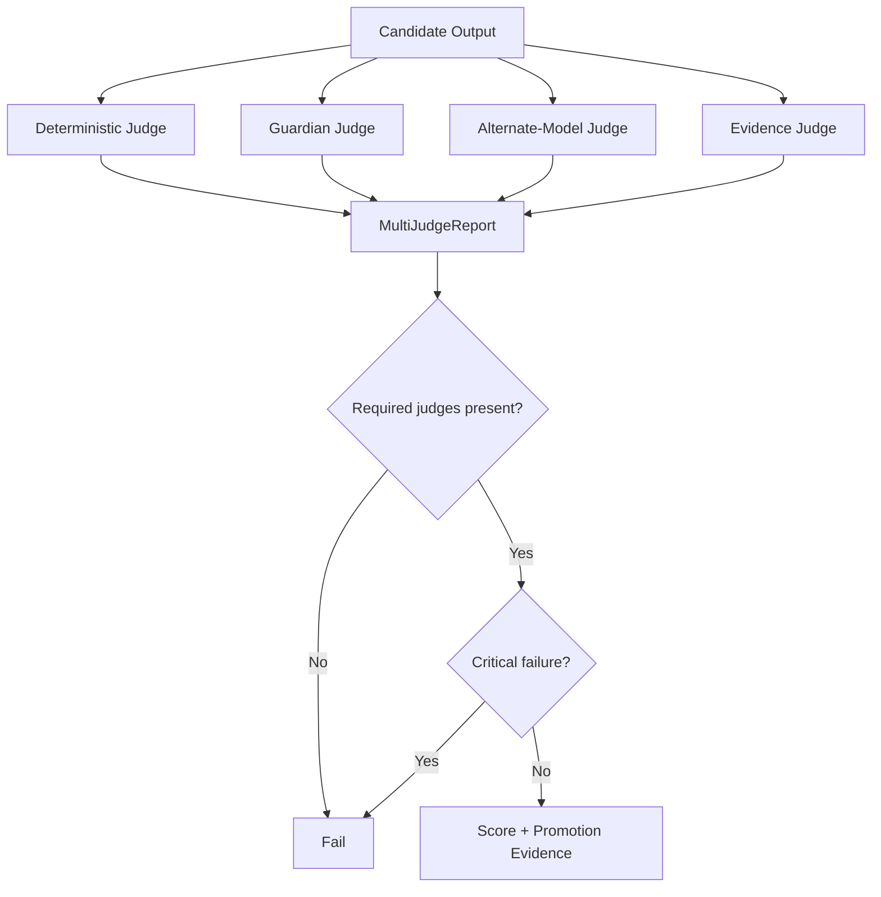

# Multi-Judge Evaluation

Nexus Starship Guardians should not let a single Guardian or model exclusively judge its own work. `MultiJudgeReport` combines independent evidence types.

## Judge classes

1. **Deterministic judge** — tests, lint, schemas, static checks, exact assertions.
2. **Guardian judge** — completeness, reasoning, architecture, maintainability.
3. **Alternate-model judge** — semantic review by a different model/provider when configured.
4. **Evidence judge** — checks that claims are supported by actual artifacts, logs, screenshots, diffs, or test evidence.

By default, deterministic and evidence judges are required. A missing required judge fails the report.

A critical failed judge blocks the report even when average score is high.

## Guardrail

A high semantic score cannot override a deterministic critical failure. This prevents impressive explanations from masking failing tests, security regressions, or unsupported completion claims.
