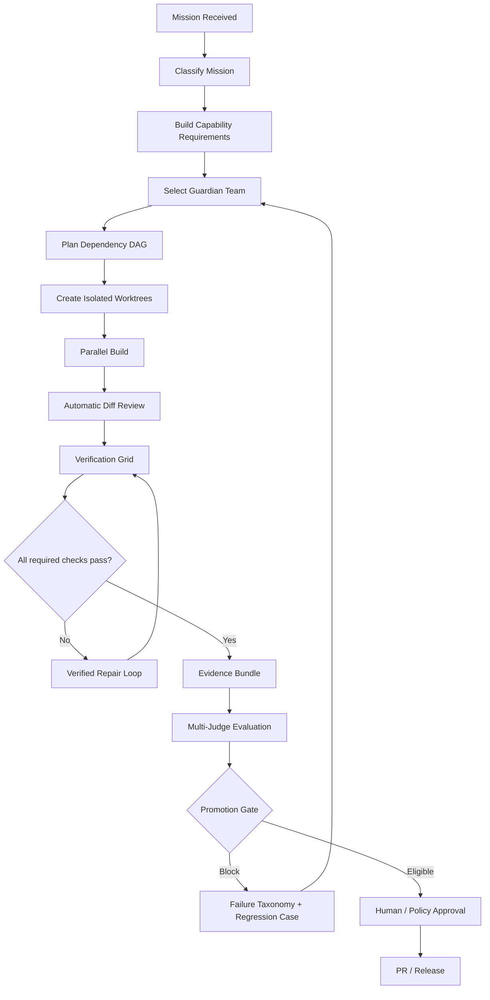
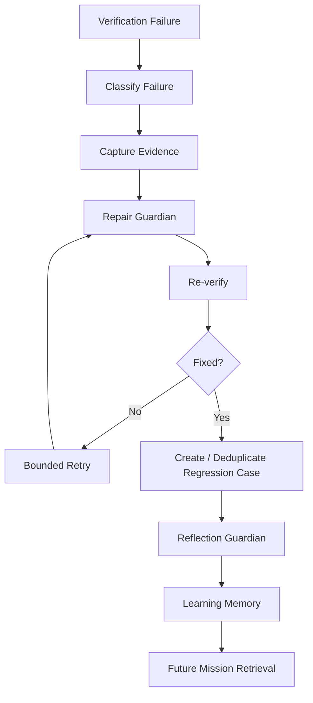
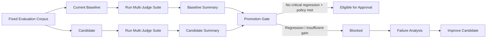
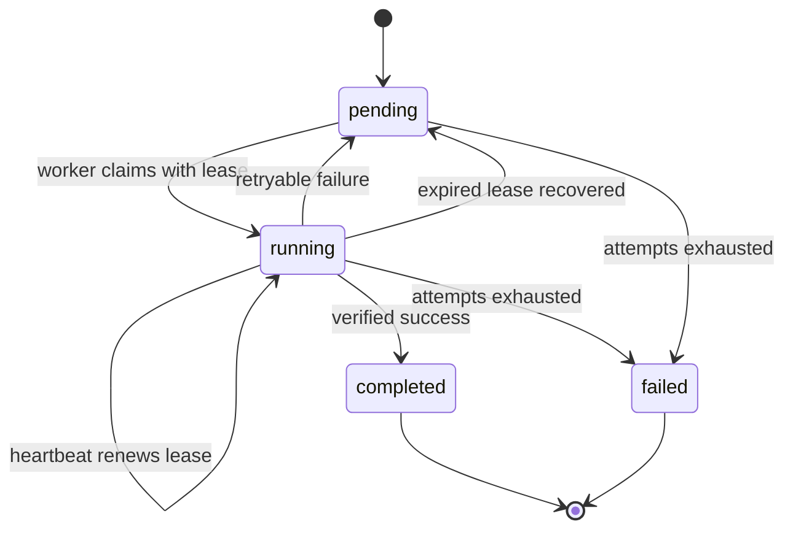

# Nexus Starship Guardians — Process Workflows

## Feature development workflow

## Failure-to-learning workflow

## Model / prompt / strategy promotion workflow

## Distributed Guardian job lifecycle

## Required evidence for a change

A repository change is considered documented when it includes, where applicable:

1. implementation code;
2. automated tests;
3. architecture/process visual updates;
4. verification evidence or CI status;
5. a learning/retrospective entry describing failures, fixes, and reusable lessons.
