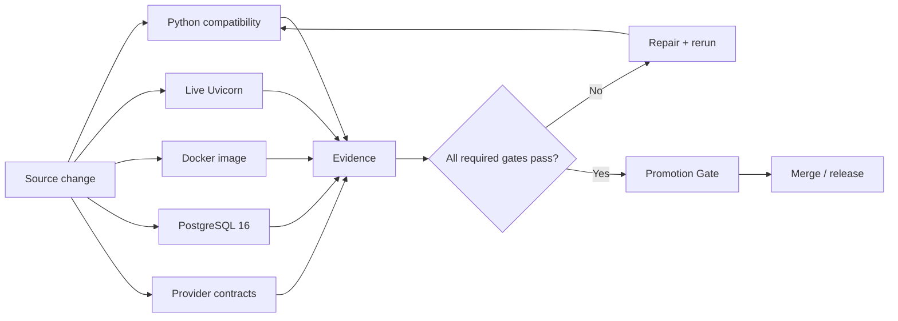
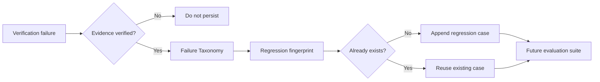

# Nexus Starship Guardians — Production Verification

Production verification closes the gap between “unit tests are green” and “the runtime actually starts and behaves correctly in a deployable environment.”

## Required gates

A change is not treated as production-ready until the applicable gates pass:

1. **Compatibility matrix** — package install, Ruff, pytest, canonical CLI, legacy CLI and REST import on Python 3.11, 3.12 and 3.13.
2. **Live HTTP gate** — start Uvicorn in a clean process and verify `/health` over TCP/HTTP.
3. **Docker gate** — validate Compose, build the Docker image, start the container, wait for Docker health and verify `/health` from the host.
4. **PostgreSQL gate** — exercise queue initialization, claims, ownership, heartbeat, completion and expired-lease recovery against PostgreSQL 16.
5. **Provider contract gate** — deterministic tests verify provider output/error contracts without requiring hosted credentials.
6. **Learning gate** — only verified failures may be promoted into the Regression Corpus.
7. **Persistence gate** — Guardian performance metrics survive process restart through the SQLite-backed Guardian Registry.

## Production verification flow

## Persistent Guardian Registry

`SQLiteGuardianRegistry` persists Guardian profiles and the metrics that adaptive routing depends on:

- attempts;
- successes;
- total/average quality score;
- total/average cost;
- total/average latency.

A restart therefore does not erase performance history. Historical metrics still do **not** grant new tool permissions; capabilities and allowlists remain explicit policy.

## Automatic failure → regression wiring

`RegressionLearningBridge` converts a failure into a Regression Corpus case only when the caller marks the evidence as verified. Unverified suspicions, model guesses, and unsupported critiques are not allowed to become persistent regression truth.

## Observability foundation

The FastAPI runtime now creates OpenTelemetry spans for incoming HTTP requests. The current implementation deliberately stops at instrumentation: exporters/backends are environment-specific and should be configured by deployment rather than hard-coded into the runtime.

Current span attributes include:

- service name;
- HTTP request method;
- URL path;
- HTTP response status.

Next observability work should add queue/Guardian mission spans, correlation IDs, structured metrics and a gated exporter configuration.

## Remaining production boundaries

This phase verifies the local/runtime deployment surfaces that GitHub Actions can reproduce safely. It does not claim that external systems such as Railway, Supabase, hosted model providers, browsers, or third-party MCP services are healthy without their dedicated credentials and environments.
