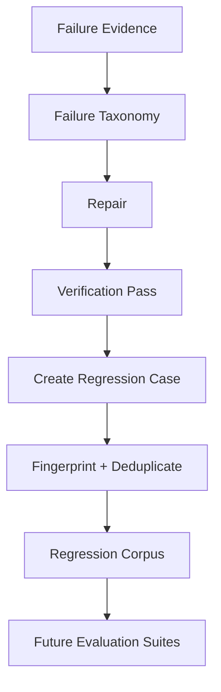

# Automatic Regression Corpus

The regression corpus converts verified failures into durable tests so Nexus Starship Guardians does not repeatedly rediscover the same defect.

## Lifecycle

## Regression case fields

- stable fingerprint-based case ID;
- title;
- original task;
- expected behavior;
- failure category;
- severity;
- provenance;
- tags;
- creation time.

Critical severity cases are queryable independently and should be included in release/promotion gates.

## Current storage

The first implementation uses append-only JSONL through `RegressionCorpus`. This keeps the format portable and auditable. A later production migration can persist the same logical schema in PostgreSQL while retaining stable case IDs.

## Rule

Only turn a failure into a trusted regression case when expected behavior is known or verified. A hallucinated repair should not become a permanent test oracle.
