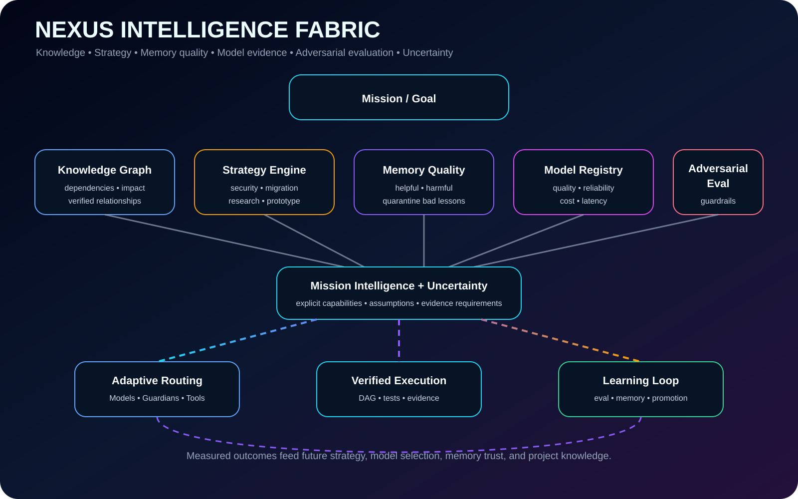
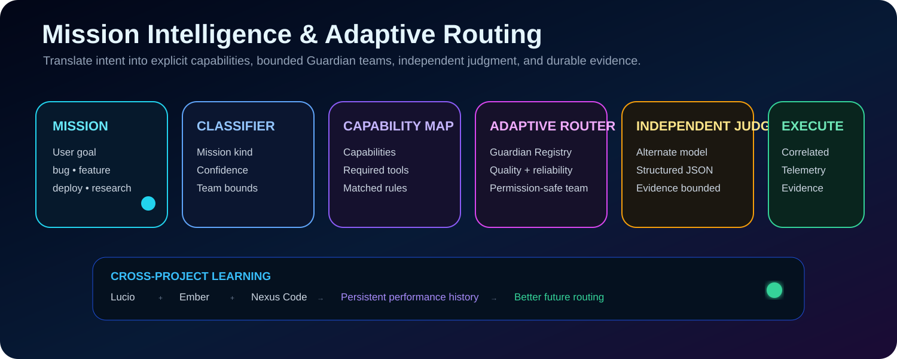
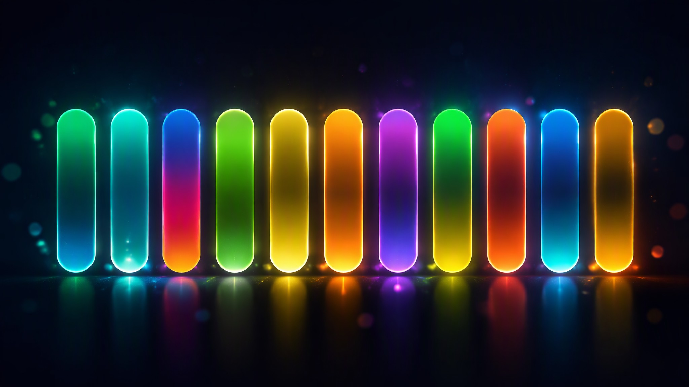

# Nexus Starship Guardians — Visual Gallery

The repository keeps architecture and process visuals close to the code so readers can understand the system before diving into modules.

## Current State Graph

This is the canonical top-level system map and must be updated whenever a meaningful architecture, intelligence, execution, evaluation, learning, integration, release, or packaging change alters the flow. In v0.7 it includes **Adaptive Guardian Intelligence**, the ten-role specialist intelligence wing, verified per-skill learning, Benchmark Replay, Coverage Intelligence, the Guardian Benchmark Vault feedback loop, Intelligence Fabric, Guardian Intelligence Lab, adaptive routing, verified execution, and release/package outputs. The editable companion is [`CURRENT_STATE.md`](CURRENT_STATE.md).

## Adaptive Guardian Intelligence

This animated graph shows how AI Architect, Software Platform Engineer, AI Developer, Coder Specialist, AI Engineer, Debugger Specialist, AI Scientist, AI Cloud Specialist, API Specialist, and AI Programmer Guardians orbit the adaptive intelligence core. Verified outcomes update per-skill quality, reliability, benchmark evidence, confidence, trend, and regression pressure. Benchmark Replay and Coverage Intelligence generate targeted learning priorities that can influence future routing without granting new permissions. See [`ADAPTIVE_GUARDIAN_INTELLIGENCE.md`](ADAPTIVE_GUARDIAN_INTELLIGENCE.md).

## Guardian Benchmark Vault

This animated graph shows the governed learning path from verified failure to Regression Corpus, evidence-linked benchmark nomination, explicit review, versioned frozen snapshot, Guardian Intelligence Lab evaluation, Promotion Gate, and release. In v0.7, candidate replay can add reproducibility evidence before review. Rejected candidates remain review history and never enter permanent benchmark truth. See [`GUARDIAN_BENCHMARK_VAULT.md`](GUARDIAN_BENCHMARK_VAULT.md).

## Intelligence Fabric

This animated visual shows the intelligence loop connecting project knowledge, strategy selection, memory quality, model-performance evidence, adversarial guardrails, uncertainty, mission intelligence, adaptive routing, verified execution, and learning. See [`INTELLIGENCE_FABRIC.md`](INTELLIGENCE_FABRIC.md).

## Project hero

## Mission intelligence and adaptive routing

This focused animated flow shows the path from mission text through classification, capability mapping, permission-safe Guardian routing, alternate-model judging, correlated telemetry, and cross-project learning. The canonical current-state graphic supersedes this focused diagram when architecture details differ.

## Production verification motion graph

## Premium visuals (v0.9.0)

A new flagship set of motion graphics and generated key art joined the gallery in v0.9.0. All of them animate directly on GitHub (SMIL + embedded CSS) and share one Apple-style design language: deep navy space backgrounds, glass panels, and the signature capsule gradients (emerald→cyan, blue→magenta→orange, lime, amber, indigo→teal) used across the roster and website.

### Hero key art

Generated key art: a flight row of glowing gradient capsules on deep navy with floor reflections — the visual signature of the 32-role specialist roster.

### Specialist roster

All **32 specialist Guardians** — the 10 elite specialists (v0.7.0), the 10-role Autonomous Operations Wing (v0.9.0), and the 12-role Agency Services Wing (v0.9.0) — orbiting the Adaptive Guardian Intelligence core. Connectors show how every wing reports verified evidence back to the core.

### Guardian Company Runtime pipeline

The company motion graph: **MISSION → BRAINSTORM (50) → EXECUTE (≤200) → TEST & QC (≤200) → REVISE (200) → SHIP**, with the orange **fast error path** that routes a failed execution Guardian to testers immediately, and the company leveling band (start at level 500, +1 on success *and* failure, shared XP to the whole company on every level-up).

### Company constellation key art

Generated key art: four wing constellations — brainstorm, execution, test & QC, revision — exchanging streams of light, one company running many missions at once.

### How automatic learning works

The six-stage verified learning loop (MISSION → EXECUTE → VERIFY → ADAPT → EVOLVE → ROUTE) around the **VERIFIED LEARNING** core. Nothing reinforces expertise without objective `test`, `api`, `browser`, or `security` evidence — the evidence panel is the contract.

### Agency Services Wing

The twelve Agency Services Guardians rendered as the signature gradient capsules, in provenance order: GIS & Spatial Analyst, Sales Pipeline Strategist, Game Design, XR & Spatial Computing, Paid Media Strategist, Financial Analysis, Healthcare Evidence, Blockchain Engineer, Embedded & IoT, Knowledge & Search, Legal & Compliance, PMO Operations.

### Guardians nebula key art

Generated key art: the radiant intelligence core with 32 orbiting gradient orbs — one orb per specialist Guardian on its verified-evidence orbit.

## Core architecture

The source-of-truth system flow is maintained in [`CURRENT_STATE.md`](CURRENT_STATE.md), [`ADAPTIVE_GUARDIAN_INTELLIGENCE.md`](ADAPTIVE_GUARDIAN_INTELLIGENCE.md), [`INTELLIGENCE_FABRIC.md`](INTELLIGENCE_FABRIC.md), [`GUARDIAN_BENCHMARK_VAULT.md`](GUARDIAN_BENCHMARK_VAULT.md), and [`ARCHITECTURE_VISUALS.md`](ARCHITECTURE_VISUALS.md). Mermaid diagrams stay editable while the animated SVGs provide an engaging GitHub-facing view.

## Process workflows

Feature delivery, verification, repair, specialist learning, benchmark replay, coverage analysis, benchmark nomination/review, and promotion workflows are maintained in [`PROCESS_WORKFLOWS.md`](PROCESS_WORKFLOWS.md).

## Visual design language

Nexus Starship Guardians visuals intentionally use a consistent command-center language:

- deep navy/space backgrounds (`#0A1128` → `#120A2E`);
- gradient capsules in emerald→cyan (`#2AF598`→`#08AEEA`), blue→magenta→orange (`#4B6CB7`→`#F857A6`→`#FF9A44`), lime (`#A8FF78`→`#78FFD6`), amber (`#F2994A`→`#F7B733`), and indigo→teal (`#1A2980`→`#26D0CE`);
- cyan for routing and verified execution;
- violet/magenta for reasoning, specialist intelligence, benchmark governance, and evaluation;
- amber for planning, caution and recovery;
- green/emerald for successful promotion/release;
- red/pink for verified failure or rejected paths;
- animated signal paths (dash drift, particles, pulsing cores) for system flow;
- SF Pro-style type stack with compact engineering labels rather than decorative-only diagrams.

Visuals are documentation. When behavior changes, the corresponding graph should change in the same pull request.
