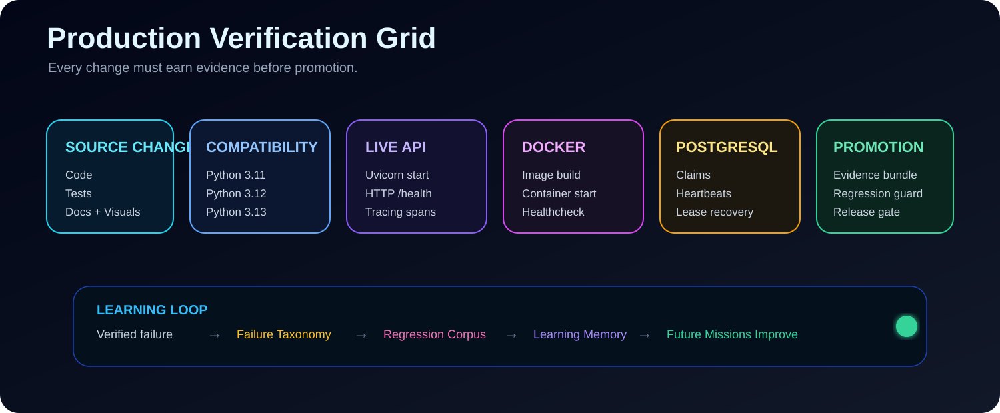

# Nexus Starship Guardians — Visual Gallery

The repository keeps architecture and process visuals close to the code so readers can understand the system before diving into modules.

## Project hero

## Production verification motion graph

## Core architecture

The source-of-truth system flow remains in [`ARCHITECTURE_VISUALS.md`](ARCHITECTURE_VISUALS.md) and is rendered with Mermaid so the diagram stays editable as the architecture evolves.

## Process workflows

Feature delivery, verification, repair, learning, and promotion workflows are maintained in [`PROCESS_WORKFLOWS.md`](PROCESS_WORKFLOWS.md).

## Visual design language

Nexus Starship Guardians visuals intentionally use a consistent command-center language:

- deep navy/space backgrounds;
- cyan for routing and verified execution;
- violet for reasoning/evaluation;
- amber for planning, caution and recovery;
- green for successful promotion/release;
- animated signal paths for system flow;
- compact engineering labels rather than decorative-only diagrams.

Visuals are documentation. When behavior changes, the corresponding graph should change in the same pull request.
